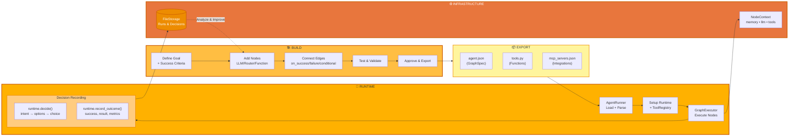
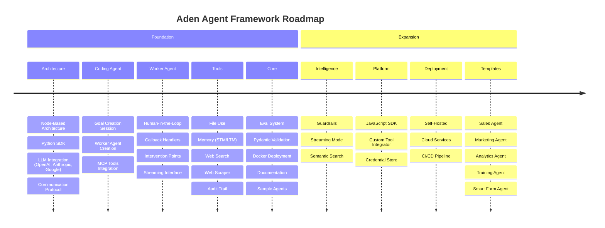

<p align="center">
  
</p>

<p align="center">
  <a href="../../README.md">English</a> |
  <a href="zh-CN.md">简体中文</a> |
  <a href="es.md">Español</a> |
  <a href="pt.md">Português</a> |
  <a href="ja.md">日本語</a> |
  <a href="ru.md">Русский</a> |
  <a href="ko.md">한국어</a>
</p>

[](https://github.com/adenhq/hive/blob/main/LICENSE)
[](https://www.ycombinator.com/companies/aden)
[](https://discord.com/invite/MXE49hrKDk)
[](https://x.com/aden_hq)
[](https://www.linkedin.com/company/teamaden/)

<p align="center">
  
  
  
  
  
</p>
<p align="center">
  
  
  
  
</p>

## Descripción General

Construye agentes de IA confiables y auto-mejorables sin codificar flujos de trabajo. Define tu objetivo a través de una conversación con un agente de codificación, y el framework genera un grafo de nodos con código de conexión creado dinámicamente. Cuando algo falla, el framework captura los datos del error, evoluciona el agente a través del agente de codificación y lo vuelve a desplegar. Los nodos de intervención humana integrados, la gestión de credenciales y el monitoreo en tiempo real te dan control sin sacrificar la adaptabilidad.

Visita [adenhq.com](https://adenhq.com) para documentación completa, ejemplos y guías.

## ¿Qué es Aden?

<p align="center">
  
</p>

Aden es una plataforma para construir, desplegar, operar y adaptar agentes de IA:

- **Construir** - Un Agente de Codificación genera Agentes de Trabajo especializados (Ventas, Marketing, Operaciones) a partir de objetivos en lenguaje natural
- **Desplegar** - Despliegue headless con integración CI/CD y gestión completa del ciclo de vida de API
- **Operar** - Monitoreo en tiempo real, observabilidad y guardarraíles de ejecución mantienen los agentes confiables
- **Adaptar** - Evaluación continua, supervisión y adaptación aseguran que los agentes mejoren con el tiempo
- **Infraestructura** - Memoria compartida, integraciones LLM, herramientas y habilidades impulsan cada agente

## Enlaces Rápidos

- **[Documentación](https://docs.adenhq.com/)** - Guías completas y referencia de API
- **[Guía de Auto-Hospedaje](https://docs.adenhq.com/getting-started/quickstart)** - Despliega Hive en tu infraestructura
- **[Registro de Cambios](https://github.com/adenhq/hive/releases)** - Últimas actualizaciones y versiones
<!-- - **[Hoja de Ruta](https://adenhq.com/roadmap)** - Funciones y planes próximos -->
- **[Reportar Problemas](https://github.com/adenhq/hive/issues)** - Reportes de bugs y solicitudes de funciones

## Inicio Rápido

### Prerrequisitos

- [Python 3.11+](https://www.python.org/downloads/) - Para desarrollo de agentes

### Instalación

```bash
# Clonar el repositorio
git clone https://github.com/adenhq/hive.git
cd hive

# Ejecutar configuración del entorno Python
./quickstart.sh
```

Esto instala:
- **framework** - Runtime del agente principal y ejecutor de grafos
- **aden_tools** - 19 herramientas MCP para capacidades de agentes
- Todas las dependencias requeridas

### Construye Tu Primer Agente

```bash
# Instalar habilidades de Claude Code (una vez)
./quickstart.sh

# Construir un agente usando Claude Code
claude> /building-agents-construction

# Probar tu agente
claude> /testing-agent

# Ejecutar tu agente
PYTHONPATH=exports uv run python -m your_agent_name run --input '{...}'
```

**[📖 Guía de Configuración Completa](ENVIRONMENT_SETUP.md)** - Instrucciones detalladas para desarrollo de agentes

## Características

- **Desarrollo Orientado a Objetivos** - Define objetivos en lenguaje natural; el agente de codificación genera el grafo de agentes y el código de conexión para lograrlos
- **Agentes Auto-Adaptables** - El framework captura fallos, actualiza objetivos y actualiza el grafo de agentes
- **Conexiones de Nodos Dinámicas** - Sin aristas predefinidas; el código de conexión es generado por cualquier LLM capaz basado en tus objetivos
- **Nodos Envueltos en SDK** - Cada nodo obtiene memoria compartida, memoria RLM local, monitoreo, herramientas y acceso LLM de serie
- **Humano en el Bucle** - Nodos de intervención que pausan la ejecución para entrada humana con tiempos de espera y escalación configurables
- **Observabilidad en Tiempo Real** - Streaming WebSocket para monitoreo en vivo de ejecución de agentes, decisiones y comunicación entre nodos
- **Control de Costos y Presupuesto** - Establece límites de gasto, limitadores y políticas de degradación automática de modelos
- **Listo para Producción** - Auto-hospedable, construido para escala y confiabilidad

## Por Qué Aden

Los frameworks de agentes tradicionales requieren que diseñes manualmente flujos de trabajo, definas interacciones de agentes y manejes fallos de forma reactiva. Aden invierte este paradigma—**describes resultados, y el sistema se construye solo**.



### La Ventaja de Aden

| Frameworks Tradicionales | Aden |
|--------------------------|------|
| Codificar flujos de trabajo de agentes | Describir objetivos en lenguaje natural |
| Definición manual de grafos | Grafos de agentes auto-generados |
| Manejo reactivo de errores | Auto-evolución proactiva |
| Configuraciones de herramientas estáticas | Nodos dinámicos envueltos en SDK |
| Configuración de monitoreo separada | Observabilidad en tiempo real integrada |
| Gestión de presupuesto DIY | Controles de costos y degradación integrados |

### Cómo Funciona

1. **Define Tu Objetivo** → Describe lo que quieres lograr en lenguaje simple
2. **El Agente de Codificación Genera** → Crea el grafo de agentes, código de conexión y casos de prueba
3. **Los Trabajadores Ejecutan** → Los nodos envueltos en SDK se ejecutan con observabilidad completa y acceso a herramientas
4. **El Plano de Control Monitorea** → Métricas en tiempo real, aplicación de presupuesto, gestión de políticas
5. **Auto-Mejora** → En caso de fallo, el sistema evoluciona el grafo y lo vuelve a desplegar automáticamente

## Cómo se Compara Aden

Aden adopta un enfoque fundamentalmente diferente al desarrollo de agentes. Mientras que la mayoría de los frameworks requieren que codifiques flujos de trabajo o definas manualmente grafos de agentes, Aden usa un **agente de codificación para generar todo tu sistema de agentes** a partir de objetivos en lenguaje natural. Cuando los agentes fallan, el framework no solo registra errores—**evoluciona automáticamente el grafo de agentes** y lo vuelve a desplegar.

> **Nota:** Para la tabla de comparación detallada de frameworks y preguntas frecuentes, consulta el [README.md](README.md) en inglés.

### Cuándo Elegir Aden

Elige Aden cuando necesites:

- Agentes que **se auto-mejoren a partir de fallos** sin intervención manual
- **Desarrollo orientado a objetivos** donde describes resultados, no flujos de trabajo
- **Confiabilidad en producción** con recuperación y redespliegue automáticos
- **Iteración rápida** en arquitecturas de agentes sin reescribir código
- **Observabilidad completa** con monitoreo en tiempo real y supervisión humana

Elige otros frameworks cuando necesites:

- **Flujos de trabajo predecibles y con tipos seguros** (PydanticAI, Mastra)
- **RAG y procesamiento de documentos** (LlamaIndex, Haystack)
- **Investigación sobre emergencia de agentes** (CAMEL)
- **Voz/multimodal en tiempo real** (TEN Framework)
- **Encadenamiento simple de componentes** (LangChain, Swarm)

## Estructura del Proyecto

```
hive/
├── core/                   # Framework principal - Runtime de agentes, ejecutor de grafos, protocolos
├── tools/                  # Paquete de Herramientas MCP - 19 herramientas para capacidades de agentes
├── exports/                # Paquetes de Agentes - Agentes pre-construidos y ejemplos
├── docs/                   # Documentación y guías
├── scripts/                # Scripts de construcción y utilidades
├── .claude/                # Habilidades de Claude Code para construir agentes
├── ENVIRONMENT_SETUP.md    # Guía de configuración de Python para desarrollo de agentes
├── DEVELOPER.md            # Guía del desarrollador
├── CONTRIBUTING.md         # Directrices de contribución
└── ROADMAP.md              # Hoja de ruta del producto
```

## Desarrollo

### Desarrollo de Agentes en Python

Para construir y ejecutar agentes orientados a objetivos con el framework:

```bash
# Configuración única
./quickstart.sh

# Esto instala:
# - paquete framework (runtime principal)
# - paquete aden_tools (19 herramientas MCP)
# - Todas las dependencias

# Construir nuevos agentes usando habilidades de Claude Code
claude> /building-agents-construction

# Probar agentes
claude> /testing-agent

# Ejecutar agentes
PYTHONPATH=exports uv run python -m agent_name run --input '{...}'
```

Consulta [ENVIRONMENT_SETUP.md](ENVIRONMENT_SETUP.md) para instrucciones de configuración completas.

## Documentación

- **[Guía del Desarrollador](DEVELOPER.md)** - Guía completa para desarrolladores
- [Primeros Pasos](docs/getting-started.md) - Instrucciones de configuración rápida
- [Guía de Configuración](docs/configuration.md) - Todas las opciones de configuración
- [Visión General de Arquitectura](docs/architecture/README.md) - Diseño y estructura del sistema

## Hoja de Ruta

El Framework de Agentes Aden tiene como objetivo ayudar a los desarrolladores a construir agentes auto-adaptativos orientados a resultados. Encuentra nuestra hoja de ruta aquí

[ROADMAP.md](ROADMAP.md)



## Comunidad y Soporte

Usamos [Discord](https://discord.com/invite/MXE49hrKDk) para soporte, solicitudes de funciones y discusiones de la comunidad.

- Discord - [Únete a nuestra comunidad](https://discord.com/invite/MXE49hrKDk)
- Twitter/X - [@adenhq](https://x.com/aden_hq)
- LinkedIn - [Página de la Empresa](https://www.linkedin.com/company/teamaden/)

## Contribuir

¡Damos la bienvenida a las contribuciones! Por favor consulta [CONTRIBUTING.md](CONTRIBUTING.md) para las directrices.

**Importante:** Por favor, solicita que se te asigne un issue antes de enviar un PR. Comenta en el issue para reclamarlo y un mantenedor te lo asignará en 24 horas. Esto ayuda a evitar trabajo duplicado.

1. Encuentra o crea un issue y solicita asignación
2. Haz fork del repositorio
3. Crea tu rama de funcionalidad (`git checkout -b feature/amazing-feature`)
4. Haz commit de tus cambios (`git commit -m 'Add amazing feature'`)
5. Haz push a la rama (`git push origin feature/amazing-feature`)
6. Abre un Pull Request

## Únete a Nuestro Equipo

**¡Estamos contratando!** Únete a nosotros en roles de ingeniería, investigación y comercialización.

[Ver Posiciones Abiertas](https://jobs.adenhq.com/a8cec478-cdbc-473c-bbd4-f4b7027ec193/applicant)

## Seguridad

Para preocupaciones de seguridad, por favor consulta [SECURITY.md](SECURITY.md).

## Licencia

Este proyecto está licenciado bajo la Licencia Apache 2.0 - consulta el archivo [LICENSE](LICENSE) para más detalles.

## Preguntas Frecuentes (FAQ)

> **Nota:** Para las preguntas frecuentes completas, consulta el [README.md](README.md) en inglés.

**P: ¿Aden depende de LangChain u otros frameworks de agentes?**

No. Aden está construido desde cero sin dependencias de LangChain, CrewAI u otros frameworks de agentes. El framework está diseñado para ser ligero y flexible, generando grafos de agentes dinámicamente en lugar de depender de componentes predefinidos.

**P: ¿Qué proveedores de LLM soporta Aden?**

Aden soporta más de 100 proveedores de LLM a través de la integración de LiteLLM, incluyendo OpenAI (GPT-4, GPT-4o), Anthropic (modelos Claude), Google Gemini, Mistral, Groq y muchos más. Simplemente configura la variable de entorno de la clave API apropiada y especifica el nombre del modelo.

**P: ¿Aden es de código abierto?**

Sí, Aden es completamente de código abierto bajo la Licencia Apache 2.0. Fomentamos activamente las contribuciones y colaboración de la comunidad.

**P: ¿Qué hace que Aden sea diferente de otros frameworks de agentes?**

Aden genera todo tu sistema de agentes a partir de objetivos en lenguaje natural usando un agente de codificación—no codificas flujos de trabajo ni defines grafos manualmente. Cuando los agentes fallan, el framework captura automáticamente los datos del fallo, evoluciona el grafo de agentes y lo vuelve a desplegar. Este ciclo de auto-mejora es único de Aden.

**P: ¿Aden soporta flujos de trabajo con humano en el bucle?**

Sí, Aden soporta completamente flujos de trabajo con humano en el bucle a través de nodos de intervención que pausan la ejecución para entrada humana. Estos incluyen tiempos de espera configurables y políticas de escalación, permitiendo colaboración fluida entre expertos humanos y agentes de IA.

---

<p align="center">
  Hecho con 🔥 Pasión en San Francisco
</p>
