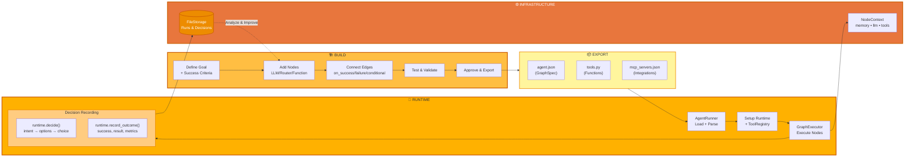
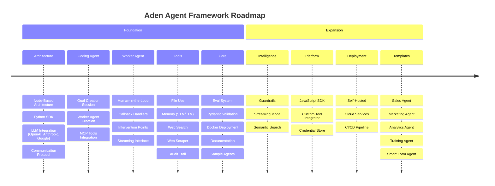

<p align="center">
  
</p>

<p align="center">
  <a href="../../README.md">English</a> |
  <a href="zh-CN.md">简体中文</a> |
  <a href="es.md">Español</a> |
  <a href="pt.md">Português</a> |
  <a href="ja.md">日本語</a> |
  <a href="ru.md">Русский</a> |
  <a href="ko.md">한국어</a>
  <a href="hi.md">हिंदी</a>
</p>

[](https://github.com/adenhq/hive/blob/main/LICENSE)
[](https://www.ycombinator.com/companies/aden)
[](https://hub.docker.com/u/adenhq)
[](https://discord.com/invite/MXE49hrKDk)
[](https://x.com/aden_hq)
[](https://www.linkedin.com/company/teamaden/)

<p align="center">
  
  
  
  
  
</p>
<p align="center">
  
  
  
  
</p>

# अवलोकन (Overview)

वर्कफ़्लो को हार्डकोड किए बिना भरोसेमंद और स्वयं-सुधार करने वाले AI एजेंट बनाएँ।
आप एक कोडिंग एजेंट के साथ बातचीत के माध्यम से अपना लक्ष्य परिभाषित करते हैं, और फ़्रेमवर्क डायनेमिक रूप से बनाए गए कनेक्शन कोड के साथ एक नोड ग्राफ़ उत्पन्न करता है। जब कुछ विफल होता है, फ़्रेमवर्क उस त्रुटि का डेटा कैप्चर करता है, कोडिंग एजेंट के माध्यम से एजेंट को विकसित करता है और उसे दोबारा डिप्लॉय करता है। एकीकृत human-in-the-loop नोड्स, क्रेडेंशियल प्रबंधन और रीयल-टाइम मॉनिटरिंग आपको अनुकूलनशीलता खोए बिना पूरा नियंत्रण देते हैं।

पूर्ण दस्तावेज़ीकरण, उदाहरणों और मार्गदर्शिकाओं के लिए adenhq.com पर जाएँ।

# Aden क्या है?

<p align="center">
  
</p>

Aden एक ऐसा प्लेटफ़ॉर्म है जो AI एजेंट्स को बनाने, डिप्लॉय करने, ऑपरेट करने और अनुकूलित करने के लिए उपयोग होता है:

- **निर्माण (Build)** – एक कोडिंग एजेंट प्राकृतिक भाषा के लक्ष्यों से विशेष वर्कर एजेंट्स (Sales, Marketing, Operations) उत्पन्न करता है

- **डिप्लॉय (Deploy)** – CI/CD इंटीग्रेशन के साथ हेडलेस डिप्लॉयमेंट और API के पूरे लाइफ़साइकल का प्रबंधन

- **ऑपरेट (Operate)** – रीयल-टाइम मॉनिटरिंग, ऑब्ज़र्वेबिलिटी और रनटाइम गार्डरेल्स एजेंट्स को भरोसेमंद बनाए रखते हैं

- **अनुकूलन (Adapt)** – निरंतर मूल्यांकन, सुपरविज़न और अनुकूलन यह सुनिश्चित करते हैं कि एजेंट समय के साथ बेहतर होते जाएँ

- **इन्फ़्रास्ट्रक्चर (Infrastructure)** – साझा मेमोरी, LLM इंटीग्रेशन, टूल्स और स्किल्स हर एजेंट को शक्ति प्रदान करते हैं

# त्वरित लिंक (Quick Links)

- **[डाक्यूमेंटेशन](https://docs.adenhq.com/)** - पूर्ण गाइड्स और API संदर्भ
- **[सेल्फ-होस्टिंग गाइड](https://docs.adenhq.com/getting-started/quickstart)** - 
Hive को अपने इंफ़्रास्ट्रक्चर पर डिप्लॉय करें
- **[चेंजलॉग](https://github.com/adenhq/hive/releases)** - नवीनतम अपडेट और रिलीज़
<!-- - **[Hoja de Ruta](https://adenhq.com/roadmap)** - Funciones y planes próximos -->
- **[इशू रिपोर्ट करें](https://github.com/adenhq/hive/issues)** - बग रिपोर्ट और फ़ीचर अनुरोध

## त्वरित शुरुआत

### आवश्यकताएँ

- [Python 3.11+](https://www.python.org/downloads/) - एजेंट विकास के लिए
- [Docker](https://docs.docker.com/get-docker/) (v20.10+) -कंटेनराइज़्ड टूल्स के लिए वैकल्पिक

### इंस्टॉलेशन

```bash
# रिपॉज़िटरी क्लोन करें
git clone https://github.com/adenhq/hive.git
cd hive

# Python वातावरण कॉन्फ़िगरेशन चलाएँ
./quickstart.sh
```

यह इंस्टॉल करता है:
- **framework** - मुख्य एजेंट रनटाइम और ग्राफ़ एक्ज़ीक्यूटर
- **aden_tools** - एजेंट क्षमताओं के लिए 19 MCP टूल्स
- सभी आवश्यक डिपेंडेंसीज़

### अपना पहला एजेंट बनाएँ

```bash
Claude Code की क्षमताएँ इंस्टॉल करें (एक बार)
./quickstart.sh

# Claude Code का उपयोग करके एक एजेंट बनाएँ
claude> /building-agents-construction

# अपने एजेंट का परीक्षण करें
claude> /testing-agent

# अपने एजेंट को चलाएँ
PYTHONPATH=exports uv run python -m your_agent_name run --input '{...}'
```

**[📖 पूर्ण कॉन्फ़िगरेशन गाइड](ENVIRONMENT_SETUP.md)** - एजेंट विकास के लिए विस्तृत निर्देश

## विशेषताएँ

- **लक्ष्य-आधारित विकास** -प्राकृतिक भाषा में लक्ष्य परिभाषित करें; कोडिंग एजेंट उन्हें हासिल करने के लिए एजेंट ग्राफ़ और कनेक्शन कोड उत्पन्न करता है
- **स्वयं-अनुकूल एजेंट्स** - फ़्रेमवर्क विफलताओं को कैप्चर करता है, उद्देश्यों को अपडेट करता है और एजेंट ग्राफ़ को अद्यतन करता है
- **डायनेमिक नोड कनेक्शन** - पूर्व-परिभाषित किनारों के बिना; आपके लक्ष्यों के आधार पर कनेक्शन कोड किसी भी सक्षम LLM द्वारा उत्पन्न किया जाता है
- **SDK-रैप्ड नोड्स** - प्रत्येक नोड को साझा मेमोरी, स्थानीय RLM मेमोरी, मॉनिटरिंग, टूल्स और LLM एक्सेस डिफ़ॉल्ट रूप से मिलता है
- **मानव-इन-द-लूप** - मानव हस्तक्षेप नोड्स जो मानव इनपुट के लिए निष्पादन को रोकते हैं, और जिनमें कॉन्फ़िगर किए जा सकने वाले टाइमआउट और एस्केलेशन होते हैं
- **रीयल-टाइम ऑब्ज़र्वेबिलिटी** - एजेंट निष्पादन, निर्णयों और नोड्स के बीच संचार की लाइव मॉनिटरिंग के लिए WebSocket स्ट्रीमिंग
- **लागत और बजट नियंत्रण** - खर्च की सीमाएँ, थ्रॉटल्स और मॉडल की स्वचालित डिग्रेडेशन नीतियाँ निर्धारित करें
- **प्रोडक्शन के लिए तैयार** - स्वयं-होस्ट करने योग्य, और स्केल व विश्वसनीयता के लिए निर्मित

# Aden क्यों?

पारंपरिक एजेंट फ़्रेमवर्क्स में आपको वर्कफ़्लो मैन्युअली डिज़ाइन करने, एजेंट इंटरैक्शन्स परिभाषित करने और विफलताओं को प्रतिक्रियात्मक रूप से संभालने की आवश्यकता होती है। Aden इस पैरेडाइम को उलट देता है—**आप परिणामों का वर्णन करते हैं, और सिस्टम अपने-आप तैयार हो जाता है**.



### Aden की बढ़त

| पारंपरिक फ़्रेमवर्क्स | Aden |
|--------------------------|------|
| एजेंट वर्कफ़्लो को हार्डकोड करना | प्राकृतिक भाषा में लक्ष्यों का वर्णन |
| ग्राफ़ की मैन्युअल परिभाषा | स्वतः-उत्पन्न एजेंट ग्राफ़ |
| त्रुटियों का प्रतिक्रियात्मक प्रबंधन | प्रॉएक्टिव स्वयं-विकास |
| स्थिर टूल कॉन्फ़िगरेशन | SDK-रैप्ड डायनेमिक नोड्स |
| अलग मॉनिटरिंग सेटअप | एकीकृत रीयल-टाइम ऑब्ज़र्वेबिलिटी |
| DIY बजट प्रबंधन | एकीकृत लागत नियंत्रण और डिग्रेडेशन नीतियाँ |

### यह कैसे काम करता है

1. **अपना लक्ष्य परिभाषित करें** → सरल भाषा में बताएं कि आप क्या हासिल करना चाहते हैं
2. **कोडिंग एजेंट उत्पन्न करता है** → एजेंट ग्राफ़, कनेक्शन कोड और टेस्ट केस तैयार करता है
3. **वर्कर एजेंट्स निष्पादन करते हैं** → SDK-रैप्ड नोड्स पूर्ण ऑब्ज़र्वेबिलिटी और टूल्स तक पहुँच के साथ निष्पादित होते हैं
4. **कंट्रोल प्लेन निगरानी करता है** → रीयल-टाइम मेट्रिक्स, बजट का प्रवर्तन और नीतियों का प्रबंधन
5. **स्वयं-सुधार** → विफलता की स्थिति में, सिस्टम ग्राफ़ को विकसित करता है और उसे स्वचालित रूप से दोबारा डिप्लॉय करता है

## Aden की तुलना कैसे की जाती है

Aden एजेंट विकास के लिए एक मौलिक रूप से अलग दृष्टिकोण अपनाता है। जहाँ अधिकांश फ़्रेमवर्क्स आपसे वर्कफ़्लो को कोड करने या एजेंट ग्राफ़ को मैन्युअली परिभाषित करने की आवश्यकता रखते हैं, वहीं Aden एक **पूरे एजेंट सिस्टम को उत्पन्न करने के लिए एक कोडिंग एजेंट** प्राकृतिक भाषा में दिए गए लक्ष्यों से। जब एजेंट विफल होते हैं, तो फ़्रेमवर्क केवल त्रुटियाँ दर्ज नहीं करता—**एजेंट ग्राफ़ को स्वचालित रूप से विकसित करता है** और उसे दोबारा डिप्लॉय करता है.

> **नोट:** फ़्रेमवर्क्स की विस्तृत तुलना तालिका और अक्सर पूछे जाने वाले प्रश्नों के लिए, देखें [README.md](README.md) अंग्रेज़ी में.

### Aden कब चुनें

Aden तब चुनें जब आपको आवश्यकता हो:

- ऐसे एजेंट जो **विफलताओं से स्वयं-सुधार करने वाले** बिना मैन्युअल हस्तक्षेप के
- **लक्ष्य-उन्मुख विकास** जहाँ आप वर्कफ़्लो नहीं, बल्कि परिणामों का वर्णन करते हैं
- **प्रोडक्शन में विश्वसनीयता** स्वचालित रिकवरी और दोबारा डिप्लॉयमेंट के साथ
- **तेज़ पुनरावृत्ति** कोड दोबारा लिखे बिना एजेंट आर्किटेक्चर में
- **पूर्ण प्रेक्षणीयता** रीयल-टाइम निगरानी और मानवीय पर्यवेक्षण के साथ

ज़रूरत पड़ने पर अन्य फ़्रेमवर्क चुनें:

- **पूर्वानुमेय और टाइप-सुरक्षित वर्कफ़्लो** (PydanticAI, Mastra)
- **RAG और दस्तावेज़ प्रसंस्करण** (LlamaIndex, Haystack)
- **एजेंटों के उभरने पर शोध** (CAMEL)
- **रीयल-टाइम वॉइस/मल्टीमॉडल** (TEN Framework)
- **घटकों का सरल क्रमबद्ध संयोजन** (LangChain, Swarm)

## प्रोजेक्ट संरचना

```
hive/
├── core/                   # मुख्य फ्रेमवर्क – एजेंट रनटाइम, ग्राफ़ एक्ज़ीक्यूटर, प्रोटोकॉल
├── tools/                  # MCP टूल्स पैकेज – एजेंट क्षमताओं के लिए 19 टूल
├── exports/                # एजेंट पैकेज – पहले से बने एजेंट और उदाहरण
├── docs/                   # दस्तावेज़ और मार्गदर्शिकाएँ
├── scripts/                # बिल्ड स्क्रिप्ट्स और यूटिलिटीज़
├── .claude/                # एजेंट बनाने के लिए Claude Code क्षमताएँ
├── ENVIRONMENT_SETUP.md    # एजेंट डेवलपमेंट के लिए Python सेटअप गाइड
├── DEVELOPER.md            # डेवलपर गाइड
├── CONTRIBUTING.md         # योगदान दिशानिर्देश
└── ROADMAP.md              # प्रोडक्ट रोडमैप
```

## विकास

### Python में एजेंट विकास

फ़्रेमवर्क के साथ लक्ष्य-उन्मुख एजेंट बनाने और चलाने के लिए:

```bash
# एक-बार का कॉन्फ़िगरेशन
./quickstart.sh

# यह इंस्टॉल करता है:
# - फ्रेमवर्क पैकेज (मुख्य रनटाइम)
# - aden_tools पैकेज (19 MCP टूल)
# - सभी डिपेंडेंसीज़

# Claude Code क्षमताओं का उपयोग करके नए एजेंट बनाएं
claude> /building-agents-construction

# एजेंट का परीक्षण करें
claude> /testing-agent

# एजेंट चलाएँ
PYTHONPATH=exports uv run python -m agent_name run --input '{...}'
```

पूरी कॉन्फ़िगरेशन निर्देशों के लिए ENVIRONMENT_SETUP.md देखें।

## दस्तावेज़ीकरण

- **[डेवलपर गाइड](DEVELOPER.md)** - डेवलपर्स के लिए पूर्ण मार्गदर्शिका
- [शुरुआत करें](docs/getting-started.md) - त्वरित कॉन्फ़िगरेशन निर्देश
- [कॉन्फ़िगरेशन गाइड](docs/configuration.md) - सभी कॉन्फ़िगरेशन विकल्प
- [आर्किटेक्चर का अवलोकन](docs/architecture/README.md) - सिस्टम का डिज़ाइन और संरचना

## रोडमैप

एडेन एजेंट फ़्रेमवर्क का उद्देश्य डेवलपर्स को परिणाम-उन्मुख, स्वयं-अनुकूलित एजेंट बनाने में मदद करना है। हमारी रोडमैप यहाँ देखें।

[ROADMAP.md](ROADMAP.md)



## समुदाय और सहायता

हम उपयोग करते हैं [Discord](https://discord.com/invite/MXE49hrKDk) सपोर्ट, फ़ीचर अनुरोधों और कम्युनिटी चर्चाओं के लिए।

- Discord - [हमारे समुदाय से जुड़ें](https://discord.com/invite/MXE49hrKDk)
- Twitter/X - [@adenhq](https://x.com/aden_hq)
- LinkedIn - [कंपनी पेज](https://www.linkedin.com/company/teamaden/)

## योगदान करें
हम योगदान का स्वागत करते हैं! कृपया देखें [CONTRIBUTING.md] (CONTRIBUTING.md) दिशानिर्देशों के लिए.

**महत्वपूर्ण:**: कृपया PR भेजने से पहले किसी issue को अपने नाम असाइन करवाने का अनुरोध करें। उसे क्लेम करने के लिए issue पर टिप्पणी करें, और कोई मेंटेनर 24 घंटों के भीतर उसे आपको असाइन कर देगा। इससे डुप्लिकेट काम से बचाव होता है।

1. कोई issue खोजें या बनाएँ और असाइनमेंट का अनुरोध करें

2. रिपॉज़िटरी को fork करें

3. अपनी फीचर ब्रांच बनाएँ (git checkout -b feature/amazing-feature)

4. अपने बदलावों को commit करें (git commit -m 'Add amazing feature')

5. ब्रांच को push करें (git push origin feature/amazing-feature)

6. एक Pull Request खोलें

## हमारी टीम से जुड़ें

**हम भर्ती कर रहे हैं!** इंजीनियरिंग, रिसर्च और मार्केटिंग भूमिकाओं में हमारे साथ जुड़ें.

[खुली पदों को देखें](https://jobs.adenhq.com/a8cec478-cdbc-473c-bbd4-f4b7027ec193/applicant)

## सुरक्षा

सुरक्षा संबंधी चिंताओं के लिए, कृपया देखें [SECURITY.md](SECURITY.md).

## लाइसेंस

यह प्रोजेक्ट Apache 2.0 लाइसेंस के अंतर्गत लाइसेंस्ड है – फ़ाइल देखें [LICENSE](LICENSE)अधिक विवरण के लिए.

## अक्सर पूछे जाने वाले प्रश्न (FAQ)

> **नोट:** पूरी FAQ के लिए,[README.md](README.md) देखें.

**प्रश्न: क्या Aden, LangChain या अन्य एजेंट फ़्रेमवर्क पर निर्भर करता है?**

उत्तर: नहीं। Aden पूरी तरह से शून्य से बनाया गया है और यह LangChain, CrewAI या अन्य एजेंट फ़्रेमवर्क पर निर्भर नहीं है। यह फ्रेमवर्क हल्का और लचीला होने के लिए डिज़ाइन किया गया है, और यह पूर्वनिर्धारित घटकों पर निर्भर रहने के बजाय डायनेमिक रूप से एजेंट ग्राफ़ बनाता है।

**प्रश्न: Aden कौन-कौन से LLM प्रदाताओं को सपोर्ट करता है?**

उत्तर: Aden LiteLLM इंटीग्रेशन के माध्यम से 100 से अधिक LLM प्रदाताओं को सपोर्ट करता है, जिसमें OpenAI (GPT-4, GPT-4o), Anthropic (Claude मॉडल), Google Gemini, Mistral, Groq और कई अन्य शामिल हैं। बस संबंधित API कुंजी के लिए एनवायरनमेंट वेरिएबल सेट करें और मॉडल का नाम निर्दिष्ट करें।

**प्रश्न: क्या Aden ओपन-सोर्स है?**

उत्तर: हाँ, Aden पूरी तरह से ओपन-सोर्स है और यह Apache 2.0 लाइसेंस के तहत उपलब्ध है। हम समुदाय के योगदान और सहयोग को सक्रिय रूप से प्रोत्साहित करते हैं।

**प्रश्न: Aden को अन्य एजेंट फ़्रेमवर्क्स से अलग क्या बनाता है?**

उत्तर: Aden आपके एजेंट सिस्टम को प्राकृतिक भाषा में दिए गए लक्ष्यों से कोडिंग एजेंट के माध्यम से पूरी तरह उत्पन्न करता है—आपको वर्कफ़्लो को कोड करने या ग्राफ़ मैन्युअली डिफ़ाइन करने की आवश्यकता नहीं है। जब एजेंट फेल होते हैं, फ्रेमवर्क स्वचालित रूप से फेल होने वाले डेटा को कैप्चर करता है, एजेंट ग्राफ़ को विकसित करता है और उसे फिर से डिप्लॉय करता है। यह स्व-उन्नति चक्र Aden को अद्वितीय बनाता है।

**प्रश्न: क्या Aden ह्यूमन-इन-द-लूप वर्कफ़्लो को सपोर्ट करता है?**

उत्तर: हाँ, Aden ह्यूमन-इन-द-लूप वर्कफ़्लो को पूरी तरह सपोर्ट करता है। यह इंटरवेंशन नोड्स के माध्यम से संभव होता है, जो मानव इनपुट के लिए निष्पादन को रोकते हैं। इसमें कस्टमाइज़ेबल वेट टाइम्स और एस्केलेशन पॉलिसीज़ शामिल हैं, जिससे मानव विशेषज्ञ और AI एजेंट के बीच सहज सहयोग संभव होता है।

---

<p align="center">
  सैन फ्रांसिस्को में 🔥 जुनून के साथ बनाया गया
</p>


