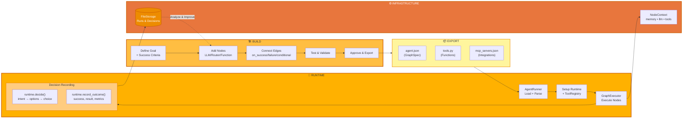
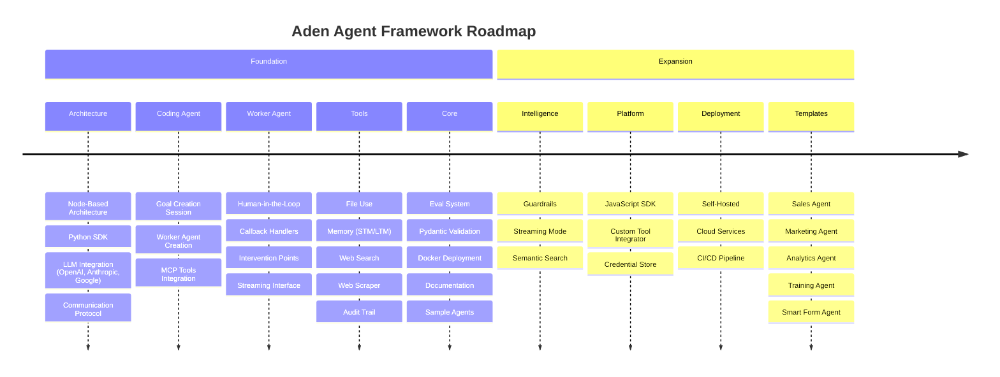

<p align="center">
  
</p>

<p align="center">
  <a href="../../README.md">English</a> |
  <a href="zh-CN.md">简体中文</a> |
  <a href="es.md">Español</a> |
  <a href="pt.md">Português</a> |
  <a href="ja.md">日本語</a> |
  <a href="ru.md">Русский</a> |
  <a href="ko.md">한국어</a>
</p>

[](https://github.com/adenhq/hive/blob/main/LICENSE)
[](https://www.ycombinator.com/companies/aden)
[](https://hub.docker.com/u/adenhq)
[](https://discord.com/invite/MXE49hrKDk)
[](https://x.com/aden_hq)
[](https://www.linkedin.com/company/teamaden/)

<p align="center">
  
  
  
  
  
</p>
<p align="center">
  
  
  
  
</p>

## 概要

ワークフローをハードコーディングせずに、信頼性の高い自己改善型AIエージェントを構築できます。コーディングエージェントとの会話を通じて目標を定義すると、フレームワークが動的に作成された接続コードを持つノードグラフを生成します。問題が発生すると、フレームワークは障害データをキャプチャし、コーディングエージェントを通じてエージェントを進化させ、再デプロイします。組み込みのヒューマンインザループノード、認証情報管理、リアルタイムモニタリングにより、適応性を損なうことなく制御を維持できます。

完全なドキュメント、例、ガイドについては [adenhq.com](https://adenhq.com) をご覧ください。

## Adenとは

<p align="center">
  
</p>

Adenは、AIエージェントの構築、デプロイ、運用、適応のためのプラットフォームです：

- **構築** - コーディングエージェントが自然言語の目標から専門的なワーカーエージェント（セールス、マーケティング、オペレーション）を生成
- **デプロイ** - CI/CD統合と完全なAPIライフサイクル管理を備えたヘッドレスデプロイメント
- **運用** - リアルタイムモニタリング、可観測性、ランタイムガードレールがエージェントの信頼性を維持
- **適応** - 継続的な評価、監督、適応により、エージェントは時間とともに改善
- **インフラ** - 共有メモリ、LLM統合、ツール、スキルがすべてのエージェントを支援

## クイックリンク

- **[ドキュメント](https://docs.adenhq.com/)** - 完全なガイドとAPIリファレンス
- **[セルフホスティングガイド](https://docs.adenhq.com/getting-started/quickstart)** - インフラストラクチャへのHiveデプロイ
- **[変更履歴](https://github.com/adenhq/hive/releases)** - 最新の更新とリリース
<!-- - **[ロードマップ](https://adenhq.com/roadmap)** - 今後の機能と計画 -->
- **[問題を報告](https://github.com/adenhq/hive/issues)** - バグレポートと機能リクエスト

## クイックスタート

### 前提条件

- [Python 3.11+](https://www.python.org/downloads/) - エージェント開発用
- [Docker](https://docs.docker.com/get-docker/) (v20.10+) - オプション、コンテナ化されたツール用

### インストール

```bash
# リポジトリをクローン
git clone https://github.com/adenhq/hive.git
cd hive

# Python環境セットアップを実行
./quickstart.sh
```

これにより以下がインストールされます：
- **framework** - コアエージェントランタイムとグラフエグゼキュータ
- **aden_tools** - エージェント機能のための19個のMCPツール
- すべての必要な依存関係

### 最初のエージェントを構築

```bash
# Claude Codeスキルをインストール（1回のみ）
./quickstart.sh

# Claude Codeを使用してエージェントを構築
claude> /building-agents-construction

# エージェントをテスト
claude> /testing-agent

# エージェントを実行
PYTHONPATH=exports uv run python -m your_agent_name run --input '{...}'
```

**[📖 完全セットアップガイド](ENVIRONMENT_SETUP.md)** - エージェント開発の詳細な手順

## 機能

- **目標駆動開発** - 自然言語で目標を定義；コーディングエージェントがそれを達成するためのエージェントグラフと接続コードを生成
- **自己適応エージェント** - フレームワークが障害をキャプチャし、目標を更新し、エージェントグラフを更新
- **動的ノード接続** - 事前定義されたエッジなし；接続コードは目標に基づいて任意の対応LLMによって生成
- **SDKラップノード** - すべてのノードが共有メモリ、ローカルRLMメモリ、モニタリング、ツール、LLMアクセスを標準装備
- **ヒューマンインザループ** - 設定可能なタイムアウトとエスカレーションを備えた、人間の入力のために実行を一時停止する介入ノード
- **リアルタイム可観測性** - エージェント実行、決定、ノード間通信のライブモニタリングのためのWebSocketストリーミング
- **コストと予算管理** - 支出制限、スロットル、自動モデル劣化ポリシーを設定
- **本番環境対応** - セルフホスト可能、スケールと信頼性のために構築

## なぜAdenか

従来のエージェントフレームワークでは、ワークフローを手動で設計し、エージェントの相互作用を定義し、障害を事後的に処理する必要があります。Adenはこのパラダイムを逆転させます—**結果を記述すれば、システムが自ら構築します**。



### Adenの優位性

| 従来のフレームワーク | Aden |
|----------------------|------|
| エージェントワークフローをハードコード | 自然言語で目標を記述 |
| 手動でグラフを定義 | 自動生成されるエージェントグラフ |
| 事後的なエラー処理 | プロアクティブな自己進化 |
| 静的なツール設定 | 動的なSDKラップノード |
| 別途モニタリング設定 | 組み込みのリアルタイム可観測性 |
| DIY予算管理 | 統合されたコスト制御と劣化 |

### 仕組み

1. **目標を定義** → 達成したいことを平易な言葉で記述
2. **コーディングエージェントが生成** → エージェントグラフ、接続コード、テストケースを作成
3. **ワーカーが実行** → SDKラップノードが完全な可観測性とツールアクセスで実行
4. **コントロールプレーンが監視** → リアルタイムメトリクス、予算執行、ポリシー管理
5. **自己改善** → 障害時、システムがグラフを進化させ自動的に再デプロイ

## Adenの比較

Adenはエージェント開発に根本的に異なるアプローチを採用しています。ほとんどのフレームワークがワークフローをハードコードするか、エージェントグラフを手動で定義することを要求するのに対し、Adenは**コーディングエージェントを使用して自然言語の目標からエージェントシステム全体を生成**します。エージェントが失敗した場合、フレームワークは単にエラーをログに記録するだけでなく—**自動的にエージェントグラフを進化させ**、再デプロイします。

> **注意：** 詳細なフレームワーク比較表とよくある質問については、英語の[README.md](README.md)を参照してください。

### Adenを選ぶべきとき

Adenを選択する場合：

- 手動介入なしに**失敗から自己改善する**エージェントが必要
- ワークフローではなく結果を記述する**目標駆動開発**が必要
- 自動回復と再デプロイを備えた**本番環境の信頼性**が必要
- コードを書き直すことなくエージェントアーキテクチャを**迅速に反復**する必要がある
- リアルタイムモニタリングと人間の監督を備えた**完全な可観測性**が必要

他のフレームワークを選択する場合：

- **型安全で予測可能なワークフロー**（PydanticAI、Mastra）
- **RAGとドキュメント処理**（LlamaIndex、Haystack）
- **エージェント創発の研究**（CAMEL）
- **リアルタイム音声/マルチモーダル**（TEN Framework）
- **シンプルなコンポーネント連鎖**（LangChain、Swarm）

## プロジェクト構造

```
hive/
├── core/                   # コアフレームワーク - エージェントランタイム、グラフエグゼキュータ、プロトコル
├── tools/                  # MCPツールパッケージ - エージェント機能のための19個のツール
├── exports/                # エージェントパッケージ - 事前構築されたエージェントと例
├── docs/                   # ドキュメントとガイド
├── scripts/                # ビルドとユーティリティスクリプト
├── .claude/                # エージェント構築用のClaude Codeスキル
├── ENVIRONMENT_SETUP.md    # エージェント開発用のPythonセットアップガイド
├── DEVELOPER.md            # 開発者ガイド
├── CONTRIBUTING.md         # 貢献ガイドライン
└── ROADMAP.md              # プロダクトロードマップ
```

## 開発

### Pythonエージェント開発

フレームワークで目標駆動エージェントを構築および実行するには：

```bash
# 1回限りのセットアップ
./quickstart.sh

# これにより以下がインストールされます：
# - frameworkパッケージ（コアランタイム）
# - aden_toolsパッケージ（19個のMCPツール）
# - すべての依存関係

# Claude Codeスキルを使用して新しいエージェントを構築
claude> /building-agents-construction

# エージェントをテスト
claude> /testing-agent

# エージェントを実行
PYTHONPATH=exports uv run python -m agent_name run --input '{...}'
```

完全なセットアップ手順については、[ENVIRONMENT_SETUP.md](ENVIRONMENT_SETUP.md)を参照してください。

## ドキュメント

- **[開発者ガイド](DEVELOPER.md)** - 開発者向け総合ガイド
- [はじめに](docs/getting-started.md) - クイックセットアップ手順
- [設定ガイド](docs/configuration.md) - すべての設定オプション
- [アーキテクチャ概要](docs/architecture/README.md) - システム設計と構造

## ロードマップ

Adenエージェントフレームワークは、開発者が結果志向で自己適応するエージェントを構築できるよう支援することを目指しています。ロードマップはこちらをご覧ください

[ROADMAP.md](ROADMAP.md)



## コミュニティとサポート

サポート、機能リクエスト、コミュニティディスカッションには[Discord](https://discord.com/invite/MXE49hrKDk)を使用しています。

- Discord - [コミュニティに参加](https://discord.com/invite/MXE49hrKDk)
- Twitter/X - [@adenhq](https://x.com/aden_hq)
- LinkedIn - [会社ページ](https://www.linkedin.com/company/teamaden/)

## 貢献

貢献を歓迎します！ガイドラインについては[CONTRIBUTING.md](CONTRIBUTING.md)をご覧ください。

**重要：** PRを提出する前に、まずIssueにアサインされてください。Issueにコメントして担当を申請すると、メンテナーが24時間以内にアサインします。これにより重複作業を防ぐことができます。

1. Issueを見つけるか作成し、アサインを受ける
2. リポジトリをフォーク
3. 機能ブランチを作成 (`git checkout -b feature/amazing-feature`)
4. 変更をコミット (`git commit -m 'Add amazing feature'`)
5. ブランチにプッシュ (`git push origin feature/amazing-feature`)
6. プルリクエストを開く

## チームに参加

**採用中です！** エンジニアリング、リサーチ、マーケティングの役職で私たちに参加してください。

[オープンポジションを見る](https://jobs.adenhq.com/a8cec478-cdbc-473c-bbd4-f4b7027ec193/applicant)

## セキュリティ

セキュリティに関する懸念については、[SECURITY.md](SECURITY.md)をご覧ください。

## ライセンス

このプロジェクトはApache License 2.0の下でライセンスされています - 詳細は[LICENSE](LICENSE)ファイルをご覧ください。

## よくある質問 (FAQ)

> **注意：** よくある質問の完全版については、英語の[README.md](README.md)を参照してください。

**Q: AdenはLangChainや他のエージェントフレームワークに依存していますか？**

いいえ。AdenはLangChain、CrewAI、その他のエージェントフレームワークに依存せずにゼロから構築されています。フレームワークは軽量で柔軟に設計されており、事前定義されたコンポーネントに依存するのではなく、エージェントグラフを動的に生成します。

**Q: AdenはどのLLMプロバイダーをサポートしていますか？**

AdenはLiteLLM統合を通じて100以上のLLMプロバイダーをサポートしており、OpenAI（GPT-4、GPT-4o）、Anthropic（Claudeモデル）、Google Gemini、Mistral、Groqなどが含まれます。適切なAPIキー環境変数を設定し、モデル名を指定するだけです。

**Q: Adenはオープンソースですか？**

はい、AdenはApache License 2.0の下で完全にオープンソースです。コミュニティの貢献とコラボレーションを積極的に奨励しています。

**Q: Adenは他のエージェントフレームワークと何が違いますか？**

Adenはコーディングエージェントを使用して自然言語の目標からエージェントシステム全体を生成します—ワークフローをハードコードしたり、グラフを手動で定義したりする必要はありません。エージェントが失敗すると、フレームワークは自動的に障害データをキャプチャし、エージェントグラフを進化させ、再デプロイします。この自己改善ループはAden独自のものです。

**Q: Adenはヒューマンインザループワークフローをサポートしていますか？**

はい、Adenは人間の入力のために実行を一時停止する介入ノードを通じて、ヒューマンインザループワークフローを完全にサポートしています。設定可能なタイムアウトとエスカレーションポリシーが含まれており、人間の専門家とAIエージェントのシームレスなコラボレーションを可能にします。

---

<p align="center">
  サンフランシスコで 🔥 情熱を込めて作成
</p>
