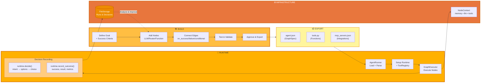
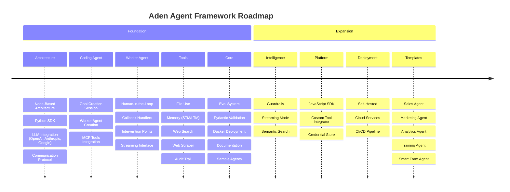

<p align="center">
  
</p>

<p align="center">
  <a href="../../README.md">English</a> |
  <a href="zh-CN.md">简体中文</a> |
  <a href="es.md">Español</a> |
  <a href="pt.md">Português</a> |
  <a href="ja.md">日本語</a> |
  <a href="ru.md">Русский</a> |
  <a href="ko.md">한국어</a>
</p>

[](https://github.com/adenhq/hive/blob/main/LICENSE)
[](https://www.ycombinator.com/companies/aden)
[](https://hub.docker.com/u/adenhq)
[](https://discord.com/invite/MXE49hrKDk)
[](https://x.com/aden_hq)
[](https://www.linkedin.com/company/teamaden/)

<p align="center">
  
  
  
  
  
</p>
<p align="center">
  
  
  
  
</p>

## 개요

워크플로우를 하드코딩할 필요 없이 안정적이고 자체 개선 기능을 갖춘 AI 에이전트를 구축하세요. 코딩 에이전트와의 대화를 통해 목표를 정의하면, 프레임워크가 동적으로 생성된 연결 코드로 구성된 노드 그래프를 자동으로 생성합니다. 문제가 발생하면 프레임워크는 실패 데이터를 수집하고, 코딩 에이전트를 통해 에이전트를 진화시킨 뒤 다시 배포합니다. 사람이 개입할 수 있는(human-in-the-loop) 노드, 자격 증명 관리, 실시간 모니터링 기능이 기본으로 제공되어, 유연성을 유지하면서도 제어권을 잃지 않도록 합니다.

자세한 문서, 예제, 가이드는 [adenhq.com](https://adenhq.com)에서 확인할 수 있습니다.

## Aden이란 무엇인가

<p align="center">
  
</p>

Aden은 AI 에이전트를 구축, 배포, 운영, 적응시키기 위한 플랫폼입니다:

- **Build** - 코딩 에이전트가 자연어로 정의된 목표를 기반으로 특화된 워커 에이전트(Sales, Marketing, Ops 등)를 생성
- **Deploy** - CI/CD 통합과 전체 API 라이프사이클 관리를 포함한 헤드리스 배포 지원
- **Operate** - 실시간 모니터링, 관측성(observability), 런타임 가드레일을 통해 에이전트를 안정적으로 유지
- **Adapt** - 지속적인 평가, 감독, 적응 과정을 통해 에이전트가 시간이 지날수록 개선되도록 보장
- **Infra** - 공유 메모리, LLM 연동, 도구, 스킬 등 모든 에이전트를 구동하는 인프라 제공

## Quick Links

- **[문서](https://docs.adenhq.com/)** - 전체 가이드와 API 레퍼런스
- **[셀프 호스팅 가이드](https://docs.adenhq.com/getting-started/quickstart)** - 자체 인프라에 Hive 배포하기
- **[변경 사항(Changelog)](https://github.com/adenhq/hive/releases)** - 최신 업데이트 및 릴리스 내역
<!-- - **[로드맵](https://adenhq.com/roadmap)** - 향후 기능 및 계획 -->
- **[이슈 신고](https://github.com/adenhq/hive/issues)** - 버그 리포트 및 기능 요청

## 빠른 시작

### 사전 요구 사항

- 에이전트 개발을 위한 [Python 3.11+](https://www.python.org/downloads/)
- 컨테이너 기반 도구 사용 시 선택 사항: [Docker](https://docs.docker.com/get-docker/) (v20.10+)

### 설치

```bash
# 저장소 클론
git clone https://github.com/adenhq/hive.git
cd hive

# Python 환경 설정 실행
./quickstart.sh
```

다음 요소들이 설치됩니다:
- **framework** - 핵심 에이전트 런타임 및 그래프 실행기
- **aden_tools** - 에이전트 기능을 위한 19개의 MCP 도구
- 필요한 모든 의존성

### 첫 번째 에이전트 만들기

```bash
# Claude Code 스킬 설치 (최소 1회)
./quickstart.sh

# Claude Code를 사용해 에이전트 빌드
claude> /building-agents

# 에이전트 테스트
claude> /testing-agent

# 에이전트 실행
PYTHONPATH=exports uv run python -m your_agent_name run --input '{...}'
```

**[📖 전체 설정 가이드](ENVIRONMENT_SETUP.md)** - 에이전트 개발을 위한 상세한 설명

## 주요 기능

- **목표 기반 개발** - 자연어로 목표를 정의하면,  코딩 에이전트가 이를 달성하기 위한 에이전트 그래프와 연결 코드를 생성
- **자기 적응형 에이전트** - 프레임워크가 실패를 수집하고, 목표를 갱신하며, 에이전트 그래프를 업데이트
- **동적 노드 연결** - 사전에 정의된 엣지 없어. 목표에 따라 어떤 역량을 갖춘 LLM이든 연결 코드를 생성
- **SDK 래핑 노드** - 모든 노드는 기본적으로 공유 메모리, 로컬 RLM 메모리, 모니터링, 도구, LLM 접근 권한 제공
- **사람 개입형(Human-in-the-Loop)** - 실행을 일시 중지하고 사람의 입력을 받는 개입 노드 제공 (타입아웃 및 에스컬레이션 설정 가능)
- **실시간 관측성** - WebSocket 스트리밍을 통해 에이전트 실행, 의사결정, 노드 간 통신을 실시간으로 모니터링
- **비용 및 예산 제어** - 지출 한도, 호출 제한, 자동 모델 다운그레이드 정책 설정 가능
- **프로덕션 대응** - 셀프 호스팅 가능하며, 확장성과 안정성을 고려해 설계됨

## 왜 Aden인가

기존의 에이전트 프레임워크는 워크플로를 직접 설계하고, 에이전트 간 상호작용을 정의하며, 실패를 사후적으로 처리해야 합니다. Aden은 이 패러다임을 뒤집어 — **결과만 설명하면, 시스템이 스스로를 구축합니다.**



### Aden의 강점

| 기존 프레임워크       | Aden                |
| -------------- |---------------------|
| 에이전트 워크플로 하드코딩 | 자연어로 목표를 설명         |
| 수동 그래프 정의      | 에이전트 그래프 자동 생성      |
| 사후 대응식 에러 처리   | 선제적 자기 진화           |
| 정적인 도구 설정      | 동적인 SDK 래핑 노드       |
| 별도의 모니터링 구성    | 내장된 실시간 관측성         |
| 수동 예산 관리       | 비용 제어 및 모델 다운그레이드 통합 |

### 작동 방식

1. **목표 정의** → 달성하고 싶은 결과를 평범한 영어 문장으로 설명
2. **코딩 에이전트 생성** → 에이전트 그래프, 연결 코드, 테스트 케이스를 생성
3. **워커 실행** → SDK로 래핑된 노드가 완전한 관측성과 도구 접근 권한을 갖고 실행
4. **컨트롤 플레인 모니터링** → 실시간 메트릭, 예산 집행, 정책 관리
5. **자기 개선** → 실패 시 그래프를 진화시키고 자동으로 재배포

## How Aden Compares

Aden은 에이전트 개발에 대해 근본적으로 다른 접근 방식을 취합니다. 대부분의 프레임워크가 워크플로를 하드코딩하거나 에이전트 그래프를 수동으로 정의하도록 요구하는 반면, Aden은 **코딩 에이전트를 사용해 자연어 목표로부터 전체 에이전트 시스템을 생성**합니다. 에이전트가 실패했을 때도 단순히 에러를 기록하는 데서 끝나지 않고, **에이전트 그래프를 자동으로 진화시킨 뒤 다시 배포**합니다.

### 비교 표

| 프레임워크                               | 분류              | 접근 방식                                          | Aden의 차별점                     |
| ----------------------------------- | --------------- | ---------------------------------------------- | ----------------------------- |
| **LangChain, LlamaIndex, Haystack** | 컴포넌트 라이브러리      | RAG/LLM 앱용 사전 정의 컴포넌트, 수동 연결 로직                | 전체 그래프와 연결 코드를 처음부터 자동 생성     |
| **CrewAI, AutoGen, Swarm**          | 멀티 에이전트 오케스트레이션 | 역할 기반 에이전트와 사전 정의된 협업 패턴                       | 동적으로 에이전트/연결 생성, 실패 시 적응      |
| **PydanticAI, Mastra, Agno**        | 타입 안전 프레임워크     | 알려진 워크플로를 위한 구조화된 출력 및 검증                      | 반복을 통해 구조가 형성되는 진화형 워크플로      |
| **Agent Zero, Letta**               | 개인 AI 어시스턴트     | 메모리와 학습 중심, OS-as-tool 또는 상태 기반 메모리            | 자기 복구가 가능한 프로덕션용 멀티 에이전트 시스템  |
| **CAMEL**                           | 연구용 프레임워크       | 대규모 시뮬레이션에서의 창발적 행동 연구 (최대 100만 에이전트)          | 신뢰 가능한 실행과 복구를 중시한 프로덕션 지향    |
| **TEN Framework, Genkit**           | 인프라 프레임워크       | 실시간 멀티모달(TEN) 또는 풀스택 AI(Genkit)                | 더 높은 추상화 수준에서 에이전트 로직 생성 및 진화 |
| **GPT Engineer, Motia**             | 코드 생성           | 명세 기반 코드 생성(GPT Engineer) 또는 Step 프리미티브(Motia) | 자동 실패 복구가 포함된 자기 적응형 그래프      |
| **Trading Agents**                  | 도메인 특화          | LangGraph 기반, 트레이딩 회사 역할을 하드코딩                 | 도메인 독립적, 모든 사용 사례에 맞는 구조 생성   |

### Aden을 선택해야 할 때

다음이 필요하다면 Aden을 선택:

- 수동 개입 없이 **실패로부터 스스로 개선되는 에이전트**
- 워크플로가 아닌 **결과 중심의 목표 기반 개발**
- 자동 복구와 재배포를 포함한 **프로덕션 수준의 안정성**
- 코드를 다시 쓰지 않고도 가능한 **빠른 에이전트 구조 반복**
- 실시간 모니터링과 사람 개입이 가능한 **완전한 관측성**

다음이 목적이라면 다른 프레임워크가 더 적합:

- **타입 안전하고 예측 가능한 워크플로** (PydanticAI, Mastra)
- **RAG 및 문서 처리** (LlamaIndex, Haystack)
- **에이전트 창발성 연구** (CAMEL)
- **실시간 음성·멀티모달 처리** (TEN Framework)
- **단순한 컴포넌트 체이닝** (LangChain, Swarm)

## Project Structure

```
hive/
├── core/                   # 핵심 프레임워크 – 에이전트 런타임, 그래프 실행기, 프로토콜
├── tools/                  # MCP 도구 패키지 – 에이전트 기능을 위한 19개 도구
├── exports/                # 에이전트 패키지 – 사전 제작된 에이전트 및 예제
├── docs/                   # 문서 및 가이드
├── scripts/                # 빌드 및 유틸리티 스크립트
├── .claude/                # 에이전트 생성을 위한 Claude Code 스킬
├── ENVIRONMENT_SETUP.md    # 에이전트 개발을 위한 Python 환경 설정 가이드
├── DEVELOPER.md            # 개발자 가이드
├── CONTRIBUTING.md         # 기여 가이드라인
└── ROADMAP.md              # 제품 로드맵
```

## 개발

### Python 에이전트 개발

프레임워크를 사용해 목표 기반 에이전트를 구축하고 실행하기 위한 절차입니다:

```bash
# 최초 1회 설정
./quickstart.sh

# 다음 항목들이 설치됨:
# - framework 패키지 (핵심 런타임)
# - aden_tools 패키지 (19개의 MCP 도구)
# - 모든 의존성

# Claude Code 스킬을 사용해 새 에이전트 생성
claude> /building-agents

# 에이전트 테스트
claude> /testing-agent

# 에이전트 실행
PYTHONPATH=exports uv run python -m agent_name run --input '{...}'
```

전체 설정 방법은 [ENVIRONMENT_SETUP.md](ENVIRONMENT_SETUP.md) 를 참고하세요.

## 문서

- **[개발자 가이드](DEVELOPER.md)** - 개발자를 위한 종합 가이드
- [시작하기](docs/getting-started.md) - 빠른 설정 방법
- [설정 가이드](docs/configuration.md) - 모든 설정 옵션 안내
- [아키텍처 개요](docs/architecture/README.md) - 시스템 설계 및 구조

## 로드맵

Aden Agent Framework는 개발자가 결과 중심(outcome-oriented) 이며 자기 적응형(self-adaptive) 에이전트를 구축할 수 있도록 돕는 것을 목표로 합니다.
자세한 로드맵은 아래 문서에서 확인할 수 있습니다.

[ROADMAP.md](ROADMAP.md)



## 커뮤니티 및 지원

Aden은 지원, 기능 요청, 커뮤니티 토론을 위해 [Discord](https://discord.com/invite/MXE49hrKDk)를 사용합니다.

- Discord - [커뮤니티 참여하기](https://discord.com/invite/MXE49hrKDk)
- Twitter/X - [@adenhq](https://x.com/aden_hq)
- LinkedIn - [회사 페이지](https://www.linkedin.com/company/teamaden/)

## 기여하기

기여를 환영합니다. 기여 가이드라인은 [CONTRIBUTING.md](CONTRIBUTING.md)를 참고해 주세요.

**중요:** PR을 제출하기 전에 먼저 Issue에 할당받으세요. Issue에 댓글을 달아 담당을 요청하면 유지관리자가 24시간 내에 할당해 드립니다. 이는 중복 작업을 방지하는 데 도움이 됩니다.

1. Issue를 찾거나 생성하고 할당받습니다
2. 저장소를 포크합니다
3. 기능 브랜치를 생성합니다 (`git checkout -b feature/amazing-feature`)
4. 변경 사항을 커밋합니다 (`git commit -m 'Add amazing feature'`)
5. 브랜치에 푸시합니다 (`git push origin feature/amazing-feature`)
6. Pull Request를 생성합니다

## 팀에 합류하세요

**채용 중입니다!** 엔지니어링, 연구, 그리고 Go-To-Market 분야에서 함께하실 분을 찾고 있습니다.

[채용 공고 보기](https://jobs.adenhq.com/a8cec478-cdbc-473c-bbd4-f4b7027ec193/applicant)

## 보안

보안 관련 문의 사항은 [SECURITY.md](SECURITY.md)를 참고해 주세요.

## 라이선스

본 프로젝트는 Apache License 2.0 하에 배포됩니다. 자세한 내용은 [LICENSE](LICENSE)를 참고해 주세요.

## Frequently Asked Questions (FAQ)

**Q: Aden은 LangChain이나 다른 에이전트 프레임워크에 의존하나요?**

아니요. Aden은 LangChain, CrewAI, 또는 기타 에이전트 프레임워크에 전혀 의존하지 않고 처음부터 새롭게 구축되었습니다. 사전에 정의된 컴포넌트에 의존하는 대신, 에이전트 그래프를 동적으로 생성하도록 설계된 가볍고 유연한 프레임워크입니다.

**Q: Aden은 어떤 LLM 제공자를 지원하나요?**

Aden은 LiteLLM 연동을 통해 100개 이상의 LLM 제공자를 지원합니다. 여기에는 OpenAI(GPT-4, GPT-4o), Anthropic(Claude 모델), Google Gemini, Mistral, Groq 등이 포함됩니다. 적절한 API 키 환경 변수를 설정하고 모델 이름만 지정하면 바로 사용할 수 있습니다.

**Ollama 같은 로컬 AI 모델과 함께 Aden을 사용할 수 있나요?**

네, 가능합니다. Aden은 LiteLLM을 통해 로컬 모델을 지원합니다. `ollama/model-name` 형식(예: `ollama/llama3`, `ollama/mistral`)으로 모델 이름을 지정하고, Ollama가 로컬에서 실행 중이면 됩니다.

**Q: Aden이 다른 에이전트 프레임워크와 다른 점은 무엇인가요?**

Aden은 코딩 에이전트를 사용해 자연어 목표로부터 전체 에이전트 시스템을 생성합니다. 워크플로를 하드코딩하거나 그래프를 수동으로 정의할 필요가 없습니다. 에이전트가 실패하면 프레임워크가 실패 데이터를 자동으로 수집하고, 에이전트 그래프를 진화시킨 뒤 다시 배포합니다. 이러한 자기 개선 루프는 Aden만의 고유한 특징입니다.

**Q: Aden은 오픈소스인가요?**

네. Aden은 Apache License 2.0 하에 배포되는 완전한 오픈소스 프로젝트입니다. 커뮤니티의 기여와 협업을 적극적으로 장려하고 있습니다.

**Q: Aden은 사용자 데이터를 수집하나요?**

Aden은 모니터링과 관측성을 위해 토큰 사용량, 지연 시간 메트릭, 비용 추적과 같은 텔레메트리 데이터를 수집합니다. 프롬프트 및 응답과 같은 콘텐츠 수집은 설정 가능하며, 팀 단위로 격리된 상태로 저장됩니다. 셀프 호스팅 환경에서는 모든 데이터가 사용자의 인프라 내부에만 저장됩니다.

**Q: Aden은 어떤 배포 방식을 지원하나요?**

Aden은 Python 패키지를 통한 셀프 호스팅 배포를 지원합니다. 설치 방법은 [환경 설정 가이드](ENVIRONMENT_SETUP.md)를 참조하세요. 클라우드 배포 옵션과 Kubernetes 대응 설정은 로드맵에 포함되어 있습니다.

**Q: Aden은 복잡한 프로덕션 규모의 사용 사례도 처리할 수 있나요?**

네. Aden은 자동 실패 복구, 실시간 관측성, 비용 제어, 수평 확장 지원 등 프로덕션 환경을 명확히 목표로 설계되었습니다. 단순한 자동화부터 복잡한 멀티 에이전트 워크플로까지 모두 처리할 수 있습니다.

**Q: Aden은 Human-in-the-Loop 워크플로를 지원하나요?**

네. Aden은 사람의 입력을 받기 위해 실행을 일시 중지하는 개입 노드를 통해 Human-in-the-Loop 워크플로를 완전히 지원합니다. 타임아웃과 에스컬레이션 정책을 설정할 수 있어, 인간 전문가와 AI 에이전트 간의 원활한 협업이 가능합니다.

**Q: Aden은 어떤 모니터링 및 디버깅 도구를 제공하나요?**

Aden은 다음과 같은 포괄적인 관측성 기능을 제공합니다. 실시간 에이전트 실행 모니터링을 위한 WebSocket 스트리밍, TimescaleDB 기반의 비용 및 성능 메트릭 분석, Kubernetes 연동을 위한 헬스 체크 엔드포인트, 예산 관리, 에이전트 상태, 정책 제어를 위한 19개의 MCP 도구

**Q: Aden은 어떤 프로그래밍 언어를 지원하나요?**

Aden은 Python과 JavaScript/TypeScript SDK를 모두 제공합니다. Python SDK에는 LangGraph, LangFlow, LiveKit 연동 템플릿이 포함되어 있습니다. 백엔드는 Node.js/TypeScript로 구현되어 있으며, 프론트엔드는 React/TypeScript를 사용합니다.

**Q: Aden 에이전트는 외부 도구나 API와 연동할 수 있나요?**

네. Aden의 SDK로 래핑된 노드는 기본적인 도구 접근 기능을 제공하며, 유연한 도구 생태계를 지원합니다. 노드 아키텍처를 통해 외부 API, 데이터베이스, 다양한 서비스와 연동할 수 있습니다.

**Q: Aden에서 비용 제어는 어떻게 이루어지나요??**

Aden은 지출 한도, 호출 제한, 자동 모델 다운그레이드 정책 등 세밀한 예산 제어 기능을 제공합니다. 팀, 에이전트, 워크플로 단위로 예산을 설정할 수 있으며, 실시간 비용 추적과 알림 기능을 제공합니다.

**Q: 예제와 문서는 어디에서 확인할 수 있나요?**

전체 가이드, API 레퍼런스, 시작 튜토리얼은 [docs.adenhq.com](https://docs.adenhq.com/) 에서 확인하실 수 있습니다. 또한 저장소의 `docs/` 디렉터리와 종합적인 [DEVELOPER.md](DEVELOPER.md) 가이드도 함께 제공됩니다.

**Q: Aden에 기여하려면 어떻게 해야 하나요?**

기여를 환영합니다. 저장소를 포크하고 기능 브랜치를 생성한 뒤 변경 사항을 구현하여 Pull Request를 제출해 주세요. 자세한 내용은 [CONTRIBUTING.md](CONTRIBUTING.md)를 참고해 주세요.

**Q: Aden은 엔터프라이즈 지원을 제공하나요?**

엔터프라이즈 관련 문의는 [adenhq.com](https://adenhq.com)을 통해 Aden 팀에 연락하시거나, 지원을 위해 [Discord community](https://discord.com/invite/MXE49hrKDk)에 참여해 주시기 바랍니다.

---

<p align="center">
  Made with 🔥 Passion in San Francisco
</p>
