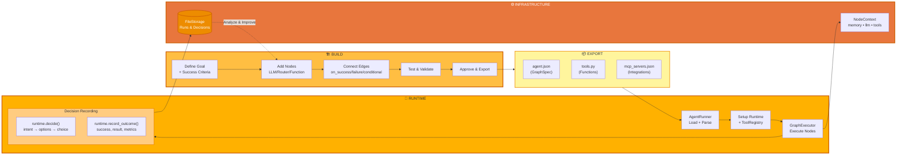
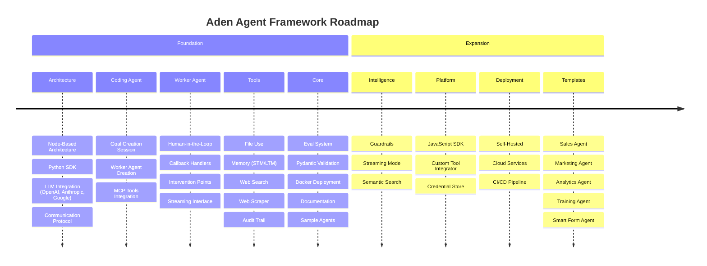

<p align="center">
  
</p>

<p align="center">
  <a href="../../README.md">English</a> |
  <a href="zh-CN.md">简体中文</a> |
  <a href="es.md">Español</a> |
  <a href="pt.md">Português</a> |
  <a href="ja.md">日本語</a> |
  <a href="ru.md">Русский</a> |
  <a href="ko.md">한국어</a>
</p>

[](https://github.com/adenhq/hive/blob/main/LICENSE)
[](https://www.ycombinator.com/companies/aden)
[](https://hub.docker.com/u/adenhq)
[](https://discord.com/invite/MXE49hrKDk)
[](https://x.com/aden_hq)
[](https://www.linkedin.com/company/teamaden/)

<p align="center">
  
  
  
  
  
</p>
<p align="center">
  
  
  
  
</p>

## Visão Geral

Construa agentes de IA confiáveis e auto-aperfeiçoáveis sem codificar fluxos de trabalho. Defina seu objetivo através de uma conversa com um agente de codificação, e o framework gera um grafo de nós com código de conexão criado dinamicamente. Quando algo quebra, o framework captura dados de falha, evolui o agente através do agente de codificação e reimplanta. Nós de intervenção humana integrados, gerenciamento de credenciais e monitoramento em tempo real dão a você controle sem sacrificar a adaptabilidade.

Visite [adenhq.com](https://adenhq.com) para documentação completa, exemplos e guias.

## O que é Aden

<p align="center">
  
</p>

Aden é uma plataforma para construir, implantar, operar e adaptar agentes de IA:

- **Construir** - Um Agente de Codificação gera Agentes de Trabalho especializados (Vendas, Marketing, Operações) a partir de objetivos em linguagem natural
- **Implantar** - Implantação headless com integração CI/CD e gerenciamento completo do ciclo de vida de API
- **Operar** - Monitoramento em tempo real, observabilidade e guardrails de runtime mantêm os agentes confiáveis
- **Adaptar** - Avaliação contínua, supervisão e adaptação garantem que os agentes melhorem ao longo do tempo
- **Infraestrutura** - Memória compartilhada, integrações LLM, ferramentas e habilidades alimentam cada agente

## Links Rápidos

- **[Documentação](https://docs.adenhq.com/)** - Guias completos e referência de API
- **[Guia de Auto-Hospedagem](https://docs.adenhq.com/getting-started/quickstart)** - Implante o Hive em sua infraestrutura
- **[Changelog](https://github.com/adenhq/hive/releases)** - Últimas atualizações e versões
<!-- - **[Roadmap](https://adenhq.com/roadmap)** - Funcionalidades e planos futuros -->
- **[Reportar Problemas](https://github.com/adenhq/hive/issues)** - Relatórios de bugs e solicitações de funcionalidades

## Início Rápido

### Pré-requisitos

- [Python 3.11+](https://www.python.org/downloads/) - Para desenvolvimento de agentes
- [Docker](https://docs.docker.com/get-docker/) (v20.10+) - Opcional, para ferramentas containerizadas

### Instalação

```bash
# Clonar o repositório
git clone https://github.com/adenhq/hive.git
cd hive

# Executar configuração do ambiente Python
./quickstart.sh
```

Isto instala:
- **framework** - Runtime do agente principal e executor de grafos
- **aden_tools** - 19 ferramentas MCP para capacidades de agentes
- Todas as dependências necessárias

### Construa Seu Primeiro Agente

```bash
# Instalar habilidades do Claude Code (uma vez)
./quickstart.sh

# Construir um agente usando Claude Code
claude> /building-agents-construction

# Testar seu agente
claude> /testing-agent

# Executar seu agente
PYTHONPATH=exports uv run python -m your_agent_name run --input '{...}'
```

**[📖 Guia Completo de Configuração](ENVIRONMENT_SETUP.md)** - Instruções detalhadas para desenvolvimento de agentes

## Funcionalidades

- **Desenvolvimento Orientado a Objetivos** - Defina objetivos em linguagem natural; o agente de codificação gera o grafo de agentes e código de conexão para alcançá-los
- **Agentes Auto-Adaptáveis** - Framework captura falhas, atualiza objetivos e atualiza o grafo de agentes
- **Conexões de Nós Dinâmicas** - Sem arestas predefinidas; código de conexão é gerado por qualquer LLM capaz baseado em seus objetivos
- **Nós Envolvidos em SDK** - Cada nó recebe memória compartilhada, memória RLM local, monitoramento, ferramentas e acesso LLM prontos para uso
- **Humano no Loop** - Nós de intervenção que pausam a execução para entrada humana com timeouts e escalonamento configuráveis
- **Observabilidade em Tempo Real** - Streaming WebSocket para monitoramento ao vivo de execução de agentes, decisões e comunicação entre nós
- **Controle de Custo e Orçamento** - Defina limites de gastos, throttles e políticas de degradação automática de modelo
- **Pronto para Produção** - Auto-hospedável, construído para escala e confiabilidade

## Por que Aden

Frameworks de agentes tradicionais exigem que você projete manualmente fluxos de trabalho, defina interações de agentes e lide com falhas reativamente. Aden inverte esse paradigma—**você descreve resultados, e o sistema se constrói sozinho**.



### A Vantagem Aden

| Frameworks Tradicionais | Aden |
|-------------------------|------|
| Codificar fluxos de trabalho de agentes | Descrever objetivos em linguagem natural |
| Definição manual de grafos | Grafos de agentes auto-gerados |
| Tratamento reativo de erros | Auto-evolução proativa |
| Configurações de ferramentas estáticas | Nós dinâmicos envolvidos em SDK |
| Configuração de monitoramento separada | Observabilidade em tempo real integrada |
| Gerenciamento de orçamento DIY | Controles de custo e degradação integrados |

### Como Funciona

1. **Defina Seu Objetivo** → Descreva o que você quer alcançar em linguagem simples
2. **Agente de Codificação Gera** → Cria o grafo de agentes, código de conexão e casos de teste
3. **Workers Executam** → Nós envolvidos em SDK executam com observabilidade completa e acesso a ferramentas
4. **Plano de Controle Monitora** → Métricas em tempo real, aplicação de orçamento, gerenciamento de políticas
5. **Auto-Aperfeiçoamento** → Em caso de falha, o sistema evolui o grafo e reimplanta automaticamente

## Como Aden se Compara

Aden adota uma abordagem fundamentalmente diferente para o desenvolvimento de agentes. Enquanto a maioria dos frameworks exige que você codifique fluxos de trabalho ou defina manualmente grafos de agentes, Aden usa um **agente de codificação para gerar todo o seu sistema de agentes** a partir de objetivos em linguagem natural. Quando os agentes falham, o framework não apenas registra erros—**ele evolui automaticamente o grafo de agentes** e reimplanta.

> **Nota:** Para a tabela de comparação detalhada de frameworks e perguntas frequentes, consulte o [README.md](README.md) em inglês.

### Quando Escolher Aden

Escolha Aden quando você precisar de:

- Agentes que **se auto-aperfeiçoam a partir de falhas** sem intervenção manual
- **Desenvolvimento orientado a objetivos** onde você descreve resultados, não fluxos de trabalho
- **Confiabilidade em produção** com recuperação e reimplantação automáticas
- **Iteração rápida** em arquiteturas de agentes sem reescrever código
- **Observabilidade completa** com monitoramento em tempo real e supervisão humana

Escolha outros frameworks quando você precisar de:

- **Fluxos de trabalho previsíveis e type-safe** (PydanticAI, Mastra)
- **RAG e processamento de documentos** (LlamaIndex, Haystack)
- **Pesquisa sobre emergência de agentes** (CAMEL)
- **Voz/multimodal em tempo real** (TEN Framework)
- **Encadeamento simples de componentes** (LangChain, Swarm)

## Estrutura do Projeto

```
hive/
├── core/                   # Framework principal - Runtime de agentes, executor de grafos, protocolos
├── tools/                  # Pacote de Ferramentas MCP - 19 ferramentas para capacidades de agentes
├── exports/                # Pacotes de Agentes - Agentes pré-construídos e exemplos
├── docs/                   # Documentação e guias
├── scripts/                # Scripts de build e utilitários
├── .claude/                # Habilidades Claude Code para construir agentes
├── ENVIRONMENT_SETUP.md    # Guia de configuração Python para desenvolvimento de agentes
├── DEVELOPER.md            # Guia do desenvolvedor
├── CONTRIBUTING.md         # Diretrizes de contribuição
└── ROADMAP.md              # Roadmap do produto
```

## Desenvolvimento

### Desenvolvimento de Agentes Python

Para construir e executar agentes orientados a objetivos com o framework:

```bash
# Configuração única
./quickstart.sh

# Isto instala:
# - pacote framework (runtime principal)
# - pacote aden_tools (19 ferramentas MCP)
# - Todas as dependências

# Construir novos agentes usando habilidades Claude Code
claude> /building-agents-construction

# Testar agentes
claude> /testing-agent

# Executar agentes
PYTHONPATH=exports uv run python -m agent_name run --input '{...}'
```

Consulte [ENVIRONMENT_SETUP.md](ENVIRONMENT_SETUP.md) para instruções completas de configuração.

## Documentação

- **[Guia do Desenvolvedor](DEVELOPER.md)** - Guia abrangente para desenvolvedores
- [Começando](docs/getting-started.md) - Instruções de configuração rápida
- [Guia de Configuração](docs/configuration.md) - Todas as opções de configuração
- [Visão Geral da Arquitetura](docs/architecture/README.md) - Design e estrutura do sistema

## Roadmap

O Aden Agent Framework visa ajudar desenvolvedores a construir agentes auto-adaptativos orientados a resultados. Encontre nosso roadmap aqui

[ROADMAP.md](ROADMAP.md)



## Comunidade e Suporte

Usamos [Discord](https://discord.com/invite/MXE49hrKDk) para suporte, solicitações de funcionalidades e discussões da comunidade.

- Discord - [Junte-se à nossa comunidade](https://discord.com/invite/MXE49hrKDk)
- Twitter/X - [@adenhq](https://x.com/aden_hq)
- LinkedIn - [Página da Empresa](https://www.linkedin.com/company/teamaden/)

## Contribuindo

Aceitamos contribuições! Por favor, consulte [CONTRIBUTING.md](CONTRIBUTING.md) para diretrizes.

**Importante:** Por favor, seja atribuído a uma issue antes de enviar um PR. Comente na issue para reivindicá-la e um mantenedor irá atribuí-la a você em 24 horas. Isso ajuda a evitar trabalho duplicado.

1. Encontre ou crie uma issue e seja atribuído
2. Faça fork do repositório
3. Crie sua branch de funcionalidade (`git checkout -b feature/amazing-feature`)
4. Faça commit das suas alterações (`git commit -m 'Add amazing feature'`)
5. Faça push para a branch (`git push origin feature/amazing-feature`)
6. Abra um Pull Request

## Junte-se ao Nosso Time

**Estamos contratando!** Junte-se a nós em funções de engenharia, pesquisa e go-to-market.

[Ver Posições Abertas](https://jobs.adenhq.com/a8cec478-cdbc-473c-bbd4-f4b7027ec193/applicant)

## Segurança

Para questões de segurança, por favor consulte [SECURITY.md](SECURITY.md).

## Licença

Este projeto está licenciado sob a Licença Apache 2.0 - veja o arquivo [LICENSE](LICENSE) para detalhes.

## Perguntas Frequentes (FAQ)

> **Nota:** Para as perguntas frequentes completas, consulte o [README.md](README.md) em inglês.

**P: O Aden depende do LangChain ou outros frameworks de agentes?**

Não. O Aden é construído do zero sem dependências do LangChain, CrewAI ou outros frameworks de agentes. O framework é projetado para ser leve e flexível, gerando grafos de agentes dinamicamente em vez de depender de componentes predefinidos.

**P: Quais provedores de LLM o Aden suporta?**

O Aden suporta mais de 100 provedores de LLM através da integração LiteLLM, incluindo OpenAI (GPT-4, GPT-4o), Anthropic (modelos Claude), Google Gemini, Mistral, Groq e muitos mais. Simplesmente configure a variável de ambiente da chave API apropriada e especifique o nome do modelo.

**P: O Aden é open-source?**

Sim, o Aden é totalmente open-source sob a Licença Apache 2.0. Incentivamos ativamente contribuições e colaboração da comunidade.

**P: O que torna o Aden diferente de outros frameworks de agentes?**

O Aden gera todo o seu sistema de agentes a partir de objetivos em linguagem natural usando um agente de codificação—você não codifica fluxos de trabalho nem define grafos manualmente. Quando os agentes falham, o framework captura automaticamente os dados de falha, evolui o grafo de agentes e reimplanta. Este loop de auto-aperfeiçoamento é único do Aden.

**P: O Aden suporta fluxos de trabalho com humano no loop?**

Sim, o Aden suporta totalmente fluxos de trabalho com humano no loop através de nós de intervenção que pausam a execução para entrada humana. Estes incluem timeouts configuráveis e políticas de escalonamento, permitindo colaboração perfeita entre especialistas humanos e agentes de IA.

---

<p align="center">
  Feito com 🔥 Paixão em San Francisco
</p>
