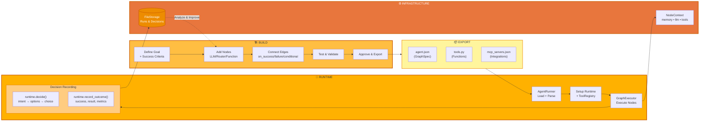
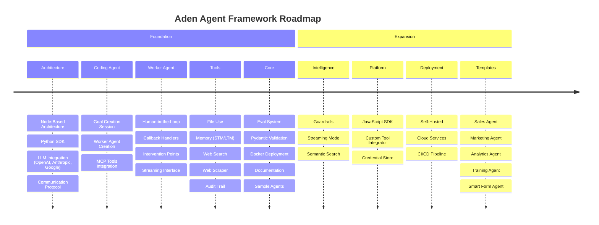

<p align="center">
  
</p>

<p align="center">
  <a href="../../README.md">English</a> |
  <a href="zh-CN.md">简体中文</a> |
  <a href="es.md">Español</a> |
  <a href="pt.md">Português</a> |
  <a href="ja.md">日本語</a> |
  <a href="ru.md">Русский</a> |
  <a href="ko.md">한국어</a>
</p>

[](https://github.com/adenhq/hive/blob/main/LICENSE)
[](https://www.ycombinator.com/companies/aden)
[](https://hub.docker.com/u/adenhq)
[](https://discord.com/invite/MXE49hrKDk)
[](https://x.com/aden_hq)
[](https://www.linkedin.com/company/teamaden/)

<p align="center">
  
  
  
  
  
</p>
<p align="center">
  
  
  
  
</p>

## Обзор

Создавайте надёжных, самосовершенствующихся ИИ-агентов без жёсткого кодирования рабочих процессов. Определите свою цель через разговор с кодирующим агентом, и фреймворк сгенерирует граф узлов с динамически созданным кодом соединений. Когда что-то ломается, фреймворк захватывает данные об ошибке, эволюционирует агента через кодирующего агента и переразвёртывает. Встроенные узлы человеческого вмешательства, управление учётными данными и мониторинг в реальном времени дают вам контроль без ущерба для адаптивности.

Посетите [adenhq.com](https://adenhq.com) для полной документации, примеров и руководств.

## Что такое Aden

<p align="center">
  
</p>

Aden — это платформа для создания, развёртывания, эксплуатации и адаптации ИИ-агентов:

- **Создание** - Кодирующий агент генерирует специализированных рабочих агентов (продажи, маркетинг, операции) из целей на естественном языке
- **Развёртывание** - Headless-развёртывание с интеграцией CI/CD и полным управлением жизненным циклом API
- **Эксплуатация** - Мониторинг в реальном времени, наблюдаемость и защитные барьеры времени выполнения обеспечивают надёжность агентов
- **Адаптация** - Непрерывная оценка, контроль и адаптация гарантируют улучшение агентов со временем
- **Инфраструктура** - Общая память, интеграции LLM, инструменты и навыки питают каждого агента

## Быстрые ссылки

- **[Документация](https://docs.adenhq.com/)** - Полные руководства и справочник API
- **[Руководство по самостоятельному хостингу](https://docs.adenhq.com/getting-started/quickstart)** - Разверните Hive в своей инфраструктуре
- **[История изменений](https://github.com/adenhq/hive/releases)** - Последние обновления и релизы
<!-- - **[Дорожная карта](https://adenhq.com/roadmap)** - Предстоящие функции и планы -->
- **[Сообщить о проблеме](https://github.com/adenhq/hive/issues)** - Отчёты об ошибках и запросы функций

## Быстрый старт

### Предварительные требования

- [Python 3.11+](https://www.python.org/downloads/) - Для разработки агентов
- [Docker](https://docs.docker.com/get-docker/) (v20.10+) - Опционально, для контейнеризованных инструментов

### Установка

```bash
# Клонировать репозиторий
git clone https://github.com/adenhq/hive.git
cd hive

# Запустить настройку окружения Python
./quickstart.sh
```

Это установит:
- **framework** - Основная среда выполнения агентов и исполнитель графов
- **aden_tools** - 19 инструментов MCP для возможностей агентов
- Все необходимые зависимости

### Создайте своего первого агента

```bash
# Установить навыки Claude Code (один раз)
./quickstart.sh

# Создать агента с помощью Claude Code
claude> /building-agents-construction

# Протестировать агента
claude> /testing-agent

# Запустить агента
PYTHONPATH=exports uv run python -m your_agent_name run --input '{...}'
```

**[📖 Полное руководство по настройке](ENVIRONMENT_SETUP.md)** - Подробные инструкции для разработки агентов

## Функции

- **Целеориентированная разработка** - Определяйте цели на естественном языке; кодирующий агент генерирует граф агентов и код соединений для их достижения
- **Самоадаптирующиеся агенты** - Фреймворк захватывает сбои, обновляет цели и обновляет граф агентов
- **Динамические соединения узлов** - Без предопределённых рёбер; код соединений генерируется любым способным LLM на основе ваших целей
- **Узлы, обёрнутые SDK** - Каждый узел получает общую память, локальную RLM-память, мониторинг, инструменты и доступ к LLM из коробки
- **Человек в контуре** - Узлы вмешательства, которые приостанавливают выполнение для человеческого ввода с настраиваемыми таймаутами и эскалацией
- **Наблюдаемость в реальном времени** - WebSocket-стриминг для живого мониторинга выполнения агентов, решений и межузловой коммуникации
- **Контроль затрат и бюджета** - Устанавливайте лимиты расходов, ограничения и политики автоматической деградации модели
- **Готовность к продакшену** - Возможность самостоятельного хостинга, создан для масштабирования и надёжности

## Почему Aden

Традиционные фреймворки агентов требуют ручного проектирования рабочих процессов, определения взаимодействий агентов и реактивной обработки сбоев. Aden переворачивает эту парадигму — **вы описываете результаты, и система строит себя сама**.



### Преимущество Aden

| Традиционные фреймворки | Aden |
|-------------------------|------|
| Жёсткое кодирование рабочих процессов | Описание целей на естественном языке |
| Ручное определение графов | Автоматически генерируемые графы агентов |
| Реактивная обработка ошибок | Проактивная самоэволюция |
| Статические конфигурации инструментов | Динамические узлы, обёрнутые SDK |
| Отдельная настройка мониторинга | Встроенная наблюдаемость в реальном времени |
| DIY управление бюджетом | Интегрированный контроль затрат и деградация |

### Как это работает

1. **Определите цель** → Опишите, чего хотите достичь, простым языком
2. **Кодирующий агент генерирует** → Создаёт граф агентов, код соединений и тестовые случаи
3. **Рабочие выполняют** → Узлы, обёрнутые SDK, работают с полной наблюдаемостью и доступом к инструментам
4. **Плоскость управления мониторит** → Метрики в реальном времени, применение бюджета, управление политиками
5. **Самосовершенствование** → При сбое система эволюционирует граф и автоматически переразвёртывает

## Сравнение Aden

Aden использует принципиально иной подход к разработке агентов. В то время как большинство фреймворков требуют жёсткого кодирования рабочих процессов или ручного определения графов агентов, Aden использует **кодирующего агента для генерации всей системы агентов** из целей на естественном языке. Когда агенты терпят неудачу, фреймворк не просто регистрирует ошибки — он **автоматически эволюционирует граф агентов** и переразвёртывает.

> **Примечание:** Для подробной таблицы сравнения фреймворков и часто задаваемых вопросов обратитесь к английской версии [README.md](README.md).

### Когда выбирать Aden

Выбирайте Aden, когда вам нужны:

- Агенты, которые **самосовершенствуются на основе сбоев** без ручного вмешательства
- **Целеориентированная разработка**, где вы описываете результаты, а не рабочие процессы
- **Надёжность продакшена** с автоматическим восстановлением и переразвёртыванием
- **Быстрая итерация** архитектур агентов без переписывания кода
- **Полная наблюдаемость** с мониторингом в реальном времени и человеческим надзором

Выбирайте другие фреймворки, когда вам нужны:

- **Предсказуемые, типобезопасные рабочие процессы** (PydanticAI, Mastra)
- **RAG и обработка документов** (LlamaIndex, Haystack)
- **Исследование эмерджентности агентов** (CAMEL)
- **Голос/мультимодальность в реальном времени** (TEN Framework)
- **Простое связывание компонентов** (LangChain, Swarm)

## Структура проекта

```
hive/
├── core/                   # Основной фреймворк - Среда выполнения агентов, исполнитель графов, протоколы
├── tools/                  # Пакет инструментов MCP - 19 инструментов для возможностей агентов
├── exports/                # Пакеты агентов - Предварительно созданные агенты и примеры
├── docs/                   # Документация и руководства
├── scripts/                # Скрипты сборки и утилиты
├── .claude/                # Навыки Claude Code для создания агентов
├── ENVIRONMENT_SETUP.md    # Руководство по настройке Python для разработки агентов
├── DEVELOPER.md            # Руководство разработчика
├── CONTRIBUTING.md         # Руководство по участию
└── ROADMAP.md              # Дорожная карта продукта
```

## Разработка

### Разработка агентов на Python

Для создания и запуска целеориентированных агентов с помощью фреймворка:

```bash
# Одноразовая настройка
./quickstart.sh

# Это установит:
# - пакет framework (основная среда выполнения)
# - пакет aden_tools (19 инструментов MCP)
# - Все зависимости

# Создать новых агентов с помощью навыков Claude Code
claude> /building-agents-construction

# Протестировать агентов
claude> /testing-agent

# Запустить агентов
PYTHONPATH=exports uv run python -m agent_name run --input '{...}'
```

Обратитесь к [ENVIRONMENT_SETUP.md](ENVIRONMENT_SETUP.md) для полных инструкций по настройке.

## Документация

- **[Руководство разработчика](DEVELOPER.md)** - Полное руководство для разработчиков
- [Начало работы](docs/getting-started.md) - Инструкции по быстрой настройке
- [Руководство по конфигурации](docs/configuration.md) - Все опции конфигурации
- [Обзор архитектуры](docs/architecture/README.md) - Дизайн и структура системы

## Дорожная карта

Aden Agent Framework призван помочь разработчикам создавать самоадаптирующихся агентов, ориентированных на результат. Найдите нашу дорожную карту здесь

[ROADMAP.md](ROADMAP.md)



## Сообщество и поддержка

Мы используем [Discord](https://discord.com/invite/MXE49hrKDk) для поддержки, запросов функций и обсуждений сообщества.

- Discord - [Присоединиться к сообществу](https://discord.com/invite/MXE49hrKDk)
- Twitter/X - [@adenhq](https://x.com/aden_hq)
- LinkedIn - [Страница компании](https://www.linkedin.com/company/teamaden/)

## Участие в разработке

Мы приветствуем вклад! Пожалуйста, ознакомьтесь с [CONTRIBUTING.md](CONTRIBUTING.md) для руководств.

**Важно:** Пожалуйста, получите назначение на issue перед отправкой PR. Оставьте комментарий в issue, чтобы заявить о своём желании работать над ним, и мейнтейнер назначит вас в течение 24 часов. Это помогает избежать дублирования работы.

1. Найдите или создайте issue и получите назначение
2. Сделайте форк репозитория
3. Создайте ветку функции (`git checkout -b feature/amazing-feature`)
4. Зафиксируйте изменения (`git commit -m 'Add amazing feature'`)
5. Отправьте в ветку (`git push origin feature/amazing-feature`)
6. Откройте Pull Request

## Присоединяйтесь к команде

**Мы нанимаем!** Присоединяйтесь к нам на позициях в инженерии, исследованиях и выходе на рынок.

[Посмотреть открытые позиции](https://jobs.adenhq.com/a8cec478-cdbc-473c-bbd4-f4b7027ec193/applicant)

## Безопасность

По вопросам безопасности, пожалуйста, обратитесь к [SECURITY.md](SECURITY.md).

## Лицензия

Этот проект лицензирован под лицензией Apache 2.0 - см. файл [LICENSE](LICENSE) для деталей.

## Часто задаваемые вопросы (FAQ)

> **Примечание:** Для полных часто задаваемых вопросов обратитесь к английской версии [README.md](README.md).

**В: Зависит ли Aden от LangChain или других фреймворков агентов?**

Нет. Aden построен с нуля без зависимостей от LangChain, CrewAI или других фреймворков агентов. Фреймворк разработан лёгким и гибким, динамически генерируя графы агентов вместо того, чтобы полагаться на предопределённые компоненты.

**В: Каких провайдеров LLM поддерживает Aden?**

Aden поддерживает более 100 провайдеров LLM через интеграцию LiteLLM, включая OpenAI (GPT-4, GPT-4o), Anthropic (модели Claude), Google Gemini, Mistral, Groq и многих других. Просто настройте соответствующую переменную окружения API-ключа и укажите имя модели.

**В: Aden с открытым исходным кодом?**

Да, Aden полностью с открытым исходным кодом под лицензией Apache 2.0. Мы активно поощряем вклад и сотрудничество сообщества.

**В: Что делает Aden отличным от других фреймворков агентов?**

Aden генерирует всю систему агентов из целей на естественном языке, используя кодирующего агента — вы не кодируете рабочие процессы и не определяете графы вручную. Когда агенты терпят неудачу, фреймворк автоматически захватывает данные о сбое, эволюционирует граф агентов и переразвёртывает. Этот цикл самосовершенствования уникален для Aden.

**В: Поддерживает ли Aden рабочие процессы с человеком в контуре?**

Да, Aden полностью поддерживает рабочие процессы с человеком в контуре через узлы вмешательства, которые приостанавливают выполнение для человеческого ввода. Они включают настраиваемые таймауты и политики эскалации, обеспечивая бесшовное сотрудничество между экспертами-людьми и ИИ-агентами.

---

<p align="center">
  Сделано с 🔥 Страстью в Сан-Франциско
</p>
