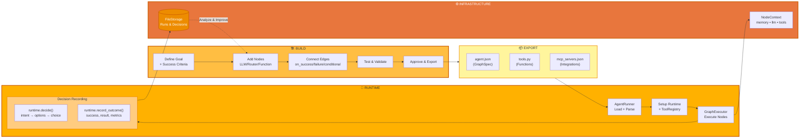
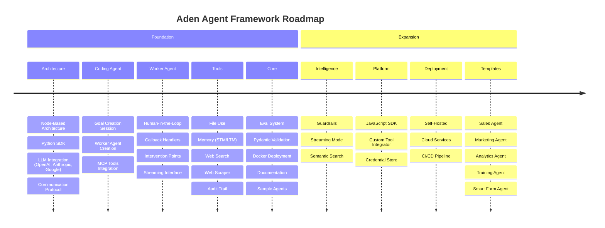

<p align="center">
  
</p>

<p align="center">
  <a href="../../README.md">English</a> |
  <a href="zh-CN.md">简体中文</a> |
  <a href="es.md">Español</a> |
  <a href="pt.md">Português</a> |
  <a href="ja.md">日本語</a> |
  <a href="ru.md">Русский</a> |
  <a href="ko.md">한국어</a>
</p>

[](https://github.com/adenhq/hive/blob/main/LICENSE)
[](https://www.ycombinator.com/companies/aden)
[](https://hub.docker.com/u/adenhq)
[](https://discord.com/invite/MXE49hrKDk)
[](https://x.com/aden_hq)
[](https://www.linkedin.com/company/teamaden/)

<p align="center">
  
  
  
  
  
</p>
<p align="center">
  
  
  
  
</p>

## 概述

构建可靠的、自我改进的 AI 智能体，无需硬编码工作流。通过与编码智能体对话来定义目标，框架会生成带有动态创建连接代码的节点图。当出现问题时，框架会捕获故障数据，通过编码智能体进化智能体，并重新部署。内置的人机协作节点、凭证管理和实时监控让您在保持适应性的同时拥有完全控制权。

访问 [adenhq.com](https://adenhq.com) 获取完整文档、示例和指南。

## 什么是 Aden

<p align="center">
  
</p>

Aden 是一个用于构建、部署、运营和适应 AI 智能体的平台：

- **构建** - 编码智能体根据自然语言目标生成专业的工作智能体（销售、营销、运营）
- **部署** - 无头部署，支持 CI/CD 集成和完整的 API 生命周期管理
- **运营** - 实时监控、可观测性和运行时护栏确保智能体可靠运行
- **适应** - 持续评估、监督和适应确保智能体随时间改进
- **基础设施** - 共享内存、LLM 集成、工具和技能为每个智能体提供支持

## 快速链接

- **[文档](https://docs.adenhq.com/)** - 完整指南和 API 参考
- **[自托管指南](https://docs.adenhq.com/getting-started/quickstart)** - 在您的基础设施上部署 Hive
- **[更新日志](https://github.com/adenhq/hive/releases)** - 最新更新和版本
<!-- - **[路线图](https://adenhq.com/roadmap)** - 即将推出的功能和计划 -->
- **[报告问题](https://github.com/adenhq/hive/issues)** - Bug 报告和功能请求

## 快速开始

### 前置要求

- [Python 3.11+](https://www.python.org/downloads/) - 用于智能体开发
- [Docker](https://docs.docker.com/get-docker/) (v20.10+) - 可选，用于容器化工具

### 安装

```bash
# 克隆仓库
git clone https://github.com/adenhq/hive.git
cd hive

# 运行 Python 环境设置
./quickstart.sh
```

这将安装：
- **framework** - 核心智能体运行时和图执行器
- **aden_tools** - 19 个 MCP 工具提供智能体能力
- 所有必需的依赖项

### 构建您的第一个智能体

```bash
# 安装 Claude Code 技能（一次性）
./quickstart.sh

# 使用 Claude Code 构建智能体
claude> /building-agents-construction

# 测试您的智能体
claude> /testing-agent

# 运行您的智能体
PYTHONPATH=exports uv run python -m your_agent_name run --input '{...}'
```

**[📖 完整设置指南](ENVIRONMENT_SETUP.md)** - 智能体开发的详细说明

## 功能特性

- **目标驱动开发** - 用自然语言定义目标；编码智能体生成智能体图和连接代码来实现它们
- **自适应智能体** - 框架捕获故障，更新目标并更新智能体图
- **动态节点连接** - 没有预定义边；连接代码由任何有能力的 LLM 根据您的目标生成
- **SDK 封装节点** - 每个节点开箱即用地获得共享内存、本地 RLM 内存、监控、工具和 LLM 访问
- **人机协作** - 干预节点暂停执行以等待人工输入，支持可配置的超时和升级
- **实时可观测性** - WebSocket 流式传输用于实时监控智能体执行、决策和节点间通信
- **成本与预算控制** - 设置支出限制、节流和自动模型降级策略
- **生产就绪** - 可自托管，为规模和可靠性而构建

## 为什么选择 Aden

传统智能体框架要求您手动设计工作流、定义智能体交互并被动处理故障。Aden 颠覆了这一范式——**您描述结果，系统自动构建自己**。



### Aden 的优势

| 传统框架 | Aden |
|----------|------|
| 硬编码智能体工作流 | 用自然语言描述目标 |
| 手动图定义 | 自动生成智能体图 |
| 被动错误处理 | 主动自我进化 |
| 静态工具配置 | 动态 SDK 封装节点 |
| 单独设置监控 | 内置实时可观测性 |
| DIY 预算管理 | 集成成本控制和降级 |

### 工作原理

1. **定义目标** → 用简单英语描述您想要实现的目标
2. **编码智能体生成** → 创建智能体图、连接代码和测试用例
3. **工作节点执行** → SDK 封装节点以完全可观测性和工具访问运行
4. **控制平面监控** → 实时指标、预算执行、策略管理
5. **自我改进** → 失败时，系统进化图并自动重新部署

## Aden 与其他框架的比较

Aden 在智能体开发方面采取了根本不同的方法。虽然大多数框架要求您硬编码工作流或手动定义智能体图，但 Aden 使用**编码智能体从自然语言目标生成整个智能体系统**。当智能体失败时，框架不仅记录错误——它会**自动进化智能体图**并重新部署。

> **注意：** 详细的框架比较表和常见问题解答，请参阅英文版 [README.md](README.md)。

### 何时选择 Aden

选择 Aden 当您需要：

- 智能体从失败中**自我改进**而无需人工干预
- **目标驱动的开发**，您描述结果而非工作流
- 具有自动恢复和重新部署的**生产可靠性**
- 无需重写代码即可**快速迭代**智能体架构
- 具有实时监控和人工监督的**完整可观测性**

选择其他框架当您需要：

- **类型安全、可预测的工作流**（PydanticAI、Mastra）
- **RAG 和文档处理**（LlamaIndex、Haystack）
- **智能体涌现的研究**（CAMEL）
- **实时语音/多模态**（TEN Framework）
- **简单的组件链接**（LangChain、Swarm）

## 项目结构

```
hive/
├── core/                   # 核心框架 - 智能体运行时、图执行器、协议
├── tools/                  # MCP 工具包 - 19 个工具提供智能体能力
├── exports/                # 智能体包 - 预构建的智能体和示例
├── docs/                   # 文档和指南
├── scripts/                # 构建和实用脚本
├── .claude/                # Claude Code 技能用于构建智能体
├── ENVIRONMENT_SETUP.md    # 智能体开发的 Python 设置指南
├── DEVELOPER.md            # 开发者指南
├── CONTRIBUTING.md         # 贡献指南
└── ROADMAP.md              # 产品路线图
```

## 开发

### Python 智能体开发

使用框架构建和运行目标驱动的智能体：

```bash
# 一次性设置
./quickstart.sh

# 这将安装：
# - framework 包（核心运行时）
# - aden_tools 包（19 个 MCP 工具）
# - 所有依赖项

# 使用 Claude Code 技能构建新智能体
claude> /building-agents-construction

# 测试智能体
claude> /testing-agent

# 运行智能体
PYTHONPATH=exports uv run python -m agent_name run --input '{...}'
```

完整设置说明请参阅 [ENVIRONMENT_SETUP.md](ENVIRONMENT_SETUP.md)。

## 文档

- **[开发者指南](DEVELOPER.md)** - 开发者综合指南
- [入门指南](docs/getting-started.md) - 快速设置说明
- [配置指南](docs/configuration.md) - 所有配置选项
- [架构概述](docs/architecture/README.md) - 系统设计和结构

## 路线图

Aden 智能体框架旨在帮助开发者构建面向结果的、自适应的智能体。请在此查看我们的路线图

[ROADMAP.md](ROADMAP.md)



## 社区与支持

我们使用 [Discord](https://discord.com/invite/MXE49hrKDk) 进行支持、功能请求和社区讨论。

- Discord - [加入我们的社区](https://discord.com/invite/MXE49hrKDk)
- Twitter/X - [@adenhq](https://x.com/aden_hq)
- LinkedIn - [公司主页](https://www.linkedin.com/company/teamaden/)

## 贡献

我们欢迎贡献！请参阅 [CONTRIBUTING.md](CONTRIBUTING.md) 了解指南。

**重要提示：** 请在提交 PR 之前先认领 Issue。在 Issue 下评论认领，维护者将在 24 小时内分配给您。我们致力于避免重复工作，让大家的努力不被浪费。

1. 找到或创建 Issue 并获得分配
2. Fork 仓库
3. 创建功能分支 (`git checkout -b feature/amazing-feature`)
4. 提交更改 (`git commit -m 'Add amazing feature'`)
5. 推送到分支 (`git push origin feature/amazing-feature`)
6. 创建 Pull Request

## 加入我们的团队

**我们正在招聘！** 加入我们的工程、研究和市场推广团队。

[查看开放职位](https://jobs.adenhq.com/a8cec478-cdbc-473c-bbd4-f4b7027ec193/applicant)

## 安全

有关安全问题，请参阅 [SECURITY.md](SECURITY.md)。

## 许可证

本项目采用 Apache License 2.0 许可证 - 详情请参阅 [LICENSE](LICENSE) 文件。

## 常见问题 (FAQ)

> **注意：** 完整的常见问题解答，请参阅英文版 [README.md](README.md)。

**问：Aden 是否依赖 LangChain 或其他智能体框架？**

不。Aden 从头开始构建，不依赖 LangChain、CrewAI 或其他智能体框架。该框架设计精简灵活，动态生成智能体图而非依赖预定义组件。

**问：Aden 支持哪些 LLM 提供商？**

Aden 通过 LiteLLM 集成支持 100 多个 LLM 提供商，包括 OpenAI（GPT-4、GPT-4o）、Anthropic（Claude 模型）、Google Gemini、Mistral、Groq 等。只需设置适当的 API 密钥环境变量并指定模型名称即可。

**问：Aden 是开源的吗？**

是的，Aden 在 Apache License 2.0 下完全开源。我们积极鼓励社区贡献和协作。

**问：Aden 与其他智能体框架有何不同？**

Aden 使用编码智能体从自然语言目标生成整个智能体系统——您无需硬编码工作流或手动定义图。当智能体失败时，框架会自动捕获故障数据、进化智能体图并重新部署。这种自我改进循环是 Aden 独有的。

**问：Aden 支持人机协作工作流吗？**

是的，Aden 通过干预节点完全支持人机协作工作流，这些节点会暂停执行以等待人工输入。包括可配置的超时和升级策略，实现人类专家与 AI 智能体的无缝协作。

---

<p align="center">
  用 🔥 热情打造于旧金山
</p>
